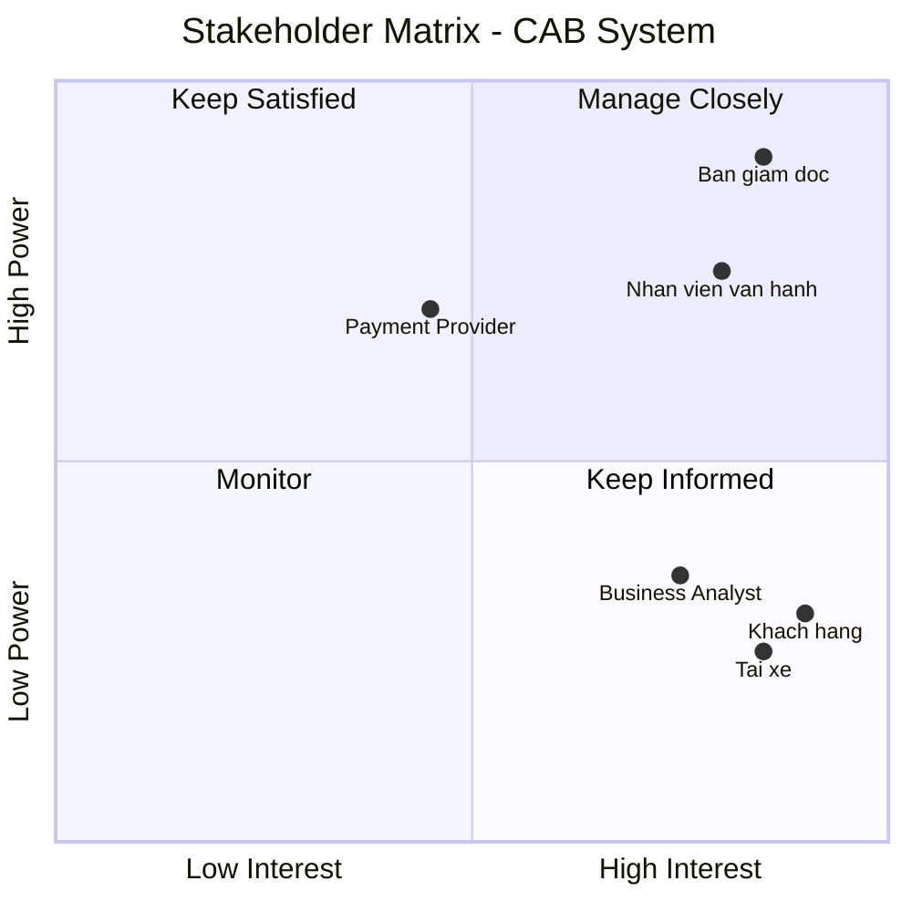
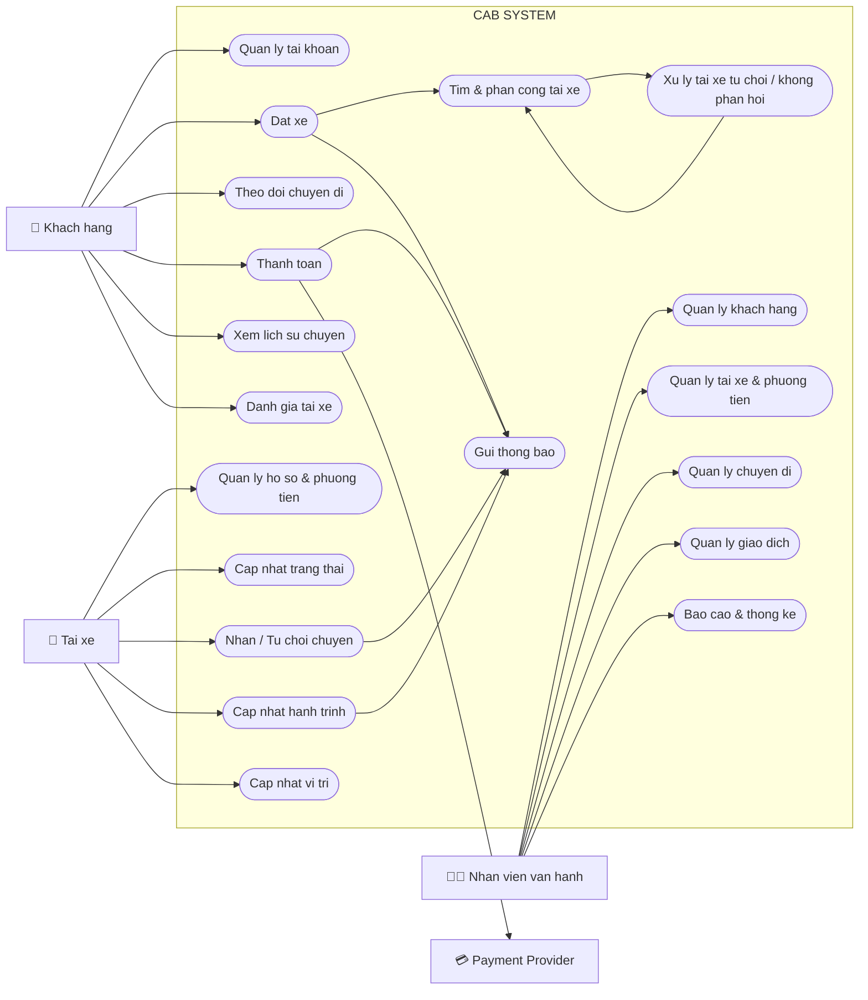
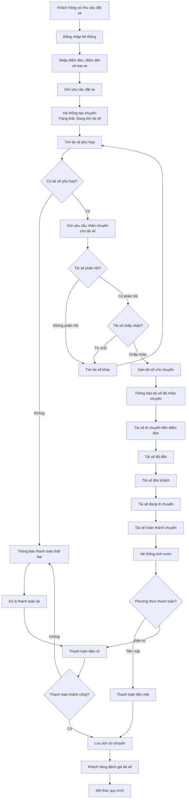

# 23696361_ThaiMaiKyHuong_cabsystem
# CAB System – Nền tảng đặt xe

## 1. KHÓ KHĂN CỦA HỆ THỐNG CAB SYSTEM

* Hệ thống chỉ có thể liên hệ đặt xe thông qua tổng đài hoặc 1 ứng dụng đơn giản.
* Phân công tài xế được thực hiện thủ công.
* Khách hàng khó theo dõi được trạng thái chuyến đi.
* Quản lý thanh toán chưa tập trung.
* Khó vận hành khi mở rộng hệ thống.
* Khó khăn về thông báo.

## * GIẢI PHÁP CHO HỆ THỐNG CAB SYSTEM

* Xây dựng ứng dụng CAB System đầy đủ chức năng đặt xe, theo dõi chuyến, thanh toán và đánh giá.
* Tự động tìm và phân công tài xế phù hợp dựa trên vị trí, trạng thái và loại xe. Nếu tài xế từ chối, tự động tìm tài xế khác.
* Cung cấp tính năng theo dõi trạng thái và vị trí tài xế theo thời gian thực.
* Xây dựng hệ thống quản lý thanh toán và tích hợp với các cổng thanh toán bên ngoài.
* Thiết kế hệ thống theo các module/service độc lập, có khả năng mở rộng từng thành phần.
* Xây dựng hệ thống thông báo đa kênh như Push Notification, SMS, Email và có thể mở rộng thêm trong tương lai.

---

## 2. XÁC ĐỊNH CÁC STAKEHOLDER

| STT | Stakeholder                           | Vai trò trong hệ thống                                                                                                |
| :-- | :------------------------------------ | :-------------------------------------------------------------------------------------------------------------------- |
| 1   | **Ban giám đốc**                      | Đưa ra định hướng, mục tiêu và yêu cầu của hệ thống; mong muốn có báo cáo về hoạt động, doanh thu và hiệu quả tài xế. |
| 2   | **Khách hàng**                        | Đăng ký, đặt xe, theo dõi chuyến đi, thanh toán, xem lịch sử và đánh giá tài xế.                                      |
| 3   | **Tài xế**                            | Quản lý hồ sơ và phương tiện, nhận/từ chối chuyến, cập nhật trạng thái và thực hiện chuyến.                           |
| 4   | **Nhân viên vận hành**                | Quản lý khách hàng, tài xế, phương tiện, chuyến đi; theo dõi chuyến đang diễn ra và xử lý các trường hợp lỗi.         |
| 5   | **Nhà cung cấp thanh toán bên ngoài** | Cung cấp dịch vụ thanh toán điện tử tích hợp cho hệ thống CAB.                                                        |
| 6   | **Business Analyst (BA)**             | Làm rõ yêu cầu, quy trình nghiệp vụ, quy tắc và các vấn đề chưa được khách hàng xác định.                             |

### Stakeholder Matrix

---
## 3. XÁC ĐỊNH BUSINESS GOAL
### 1. Tự động hóa quy trình đặt xe
Xây dựng hệ thống giúp khách hàng đặt xe trực tuyến và giảm sự phụ thuộc vào tổng đài hoặc quy trình thủ công.
### 2. Tự động hóa việc tìm và phân công tài xế
Xây dựng cơ chế tự động tìm tài xế phù hợp, ưu tiên tài xế gần khách hàng và tự động tìm tài xế khác khi tài xế từ chối hoặc không phản hồi.
### 3. Nâng cao trải nghiệm khách hàng
Cho phép khách hàng theo dõi trạng thái chuyến đi, vị trí tài xế, thời gian dự kiến đến, lịch sử chuyến và đánh giá tài xế.
### 4. Quản lý thanh toán tập trung
Xây dựng cơ chế tính cước và quản lý thanh toán, hỗ trợ tiền mặt và thanh toán điện tử thông qua nhà cung cấp bên ngoài.
### 5. Nâng cao hiệu quả vận hành
Cung cấp giao diện quản trị giúp nhân viên quản lý khách hàng, tài xế, phương tiện và chuyến đi, đồng thời xử lý các trường hợp phát sinh.
### 6. Đảm bảo khả năng mở rộng
Xây dựng nền tảng có khả năng phục vụ số lượng lớn khách hàng và tài xế, đồng thời cho phép mở rộng từng thành phần khi nhu cầu tăng.
### 7. Tăng tính ổn định và bảo mật
Đảm bảo hệ thống hoạt động ổn định khi tải cao, hạn chế việc một chức năng bị lỗi ảnh hưởng đến toàn bộ hệ thống và bảo vệ dữ liệu cá nhân, vị trí và giao dịch.
### 8. Tạo nền tảng phát triển lâu dài
Thiết kế hệ thống linh hoạt để trong tương lai có thể thêm loại dịch vụ, phương thức thanh toán, kênh thông báo và thay đổi thành phần kỹ thuật mà không phải xây dựng lại toàn bộ hệ thống.
## 4. XÁC ĐỊNH PHẠM VI HỆ THỐNG
Trong thời gian **7 tuần**, dự án tập trung xây dựng các chức năng cốt lõi của nền tảng CAB, bao gồm:
### 1. Hệ thống quản lý khách hàng
* Đăng ký, đăng nhập và xác thực tài khoản khách hàng.
* Quản lý và cập nhật thông tin cá nhân.
* Quản lý trạng thái tài khoản khách hàng.

### 2. Hệ thống quản lý tài xế và phương tiện

* Quản lý hồ sơ tài xế và thông tin phương tiện.
* Cập nhật trạng thái hoạt động của tài xế.
* Quản lý vị trí và trạng thái sẵn sàng nhận chuyến.

### 3. Hệ thống đặt xe và quản lý chuyến đi

* Khách hàng nhập điểm đón, điểm đến và lựa chọn loại xe.
* Tạo và quản lý yêu cầu đặt xe.
* Theo dõi trạng thái chuyến từ lúc đặt xe đến khi hoàn thành.
* Lưu thông tin và trạng thái của chuyến đi.

### 4. Hệ thống tìm và phân công tài xế

* Tự động tìm tài xế phù hợp dựa trên vị trí và trạng thái hoạt động.
* Ưu tiên tài xế gần khách hàng.
* Tự động tìm tài xế khác khi tài xế từ chối hoặc không phản hồi.
* Thông báo khi không tìm được tài xế.

### 5. Hệ thống tính cước và thanh toán

* Tính cước dựa trên loại dịch vụ và thông tin chuyến đi.
* Hỗ trợ thanh toán tiền mặt và thanh toán điện tử.
* Tích hợp với nhà cung cấp thanh toán bên ngoài.
* Quản lý trạng thái giao dịch và xử lý thanh toán thất bại.

### 6. Hệ thống thông báo

* Thông báo cho khách hàng và tài xế về các thay đổi quan trọng của chuyến đi.
* Thông báo khi đặt xe, tài xế nhận chuyến, tài xế đến điểm đón, hoàn thành chuyến và thanh toán.
* Thiết kế linh hoạt để có thể bổ sung thêm các kênh thông báo.

### 7. Hệ thống đánh giá và lịch sử chuyến đi

* Khách hàng có thể xem lịch sử các chuyến đã thực hiện.
* Hiển thị thông tin chuyến đi như tài xế, thời gian, trạng thái và số tiền thanh toán.
* Cho phép khách hàng đánh giá tài xế sau khi hoàn thành chuyến.
* Lưu trữ đánh giá để hỗ trợ theo dõi chất lượng dịch vụ.

### 8. Hệ thống quản trị và báo cáo

* Quản lý khách hàng, tài xế, phương tiện và chuyến đi.
* Theo dõi các chuyến đang diễn ra và xử lý các trường hợp phát sinh.
* Phân quyền cho nhân viên vận hành.
* Thống kê số lượng chuyến, doanh thu, tỷ lệ hoàn thành, tỷ lệ hủy và hiệu quả tài xế.

---

## 5. Yêu Cầu Nghiệp Vụ (Business Requirements)

### 1. Nhóm Yêu Cầu Cho Khách Hàng (Customer Requirements)

* **Quản lý tài khoản:** Khách hàng có thể đăng ký tài khoản mới, đăng nhập vào hệ thống và cập nhật thông tin cá nhân.
* **Đặt xe:** Khách hàng có thể nhập điểm đón, điểm đến, lựa chọn loại xe, gửi yêu cầu đặt xe và theo dõi trạng thái chuyến đi.
* **Theo dõi thời gian thực:** Khách hàng có thể biết được hệ thống đang tìm tài xế, xem thông tin tài xế đã nhận chuyến, thời gian dự kiến tài xế đến và trạng thái hiện tại của chuyến đi.
* **Thanh toán & Đánh giá:** Khách hàng có thể xem lịch sử chuyến đi, biết số tiền phải trả, chọn thanh toán bằng tiền mặt hoặc qua cổng thanh toán điện tử, và đánh giá tài xế sau khi hoàn thành chuyến.

### 2. Nhóm Yêu Cầu Cho Tài Xế (Driver Requirements)

* **Quản lý hồ sơ & Trạng thái:** Tài xế có thể đăng ký hoặc được nhân viên vận hành tạo tài khoản, cập nhật hồ sơ cá nhân, thông tin phương tiện và chuyển đổi trạng thái hoạt động.
* **Xử lý chuyến đi:** Tài xế nhận thông báo khi có yêu cầu phù hợp, có thể chấp nhận hoặc từ chối chuyến đi.
* **Cập nhật hành trình:** Trong quá trình thực hiện, tài xế cập nhật các mốc trạng thái: đã đến điểm đón, đã đón khách, đang di chuyển và hoàn thành chuyến đi.
* **Định vị GPS:** Hệ thống lưu trữ thông tin vị trí của tài xế để hỗ trợ việc tìm kiếm tài xế gần khách hàng và cải thiện khả năng dự kiến thời gian đến (ETA).

### 3. Nhóm Yêu Cầu Về Ghép Đôi Tài Xế (Matching Requirements)

* **Tìm kiếm & Phân phối thông minh:** Khi khách hàng tạo chuyến đi, hệ thống tự động xác định các tài xế phù hợp dựa trên vị trí, trạng thái sẵn sàng và các tiêu chí ưu tiên.
* **Cơ chế chuyển tiếp tự động:** Nếu tài xế được đề xuất không phản hồi hoặc từ chối, hệ thống tiếp tục tự động tìm tài xế khác mà không yêu cầu khách hàng phải tạo lại yêu cầu.
* **Xử lý khi không có tài xế:** Trường hợp hệ thống không tìm được tài xế phù hợp, khách hàng phải được thông báo rõ ràng.

### 4. Nhóm Yêu Cầu Về Tính Cước & Thanh Toán (Pricing & Payment Requirements)

* **Tính cước tự động:** Sau khi chuyến đi hoàn thành, hệ thống xác định số tiền khách hàng phải trả dựa trên loại dịch vụ và thông tin chuyến đi.
* **Thanh toán bảo mật:** Hỗ trợ thanh toán bằng tiền mặt hoặc tích hợp nhà cung cấp thanh toán bên ngoài, không lưu trữ thông tin nhạy cảm của thẻ/tài khoản trực tiếp trong hệ thống CAB.
* **Xử lý giao dịch lỗi:** Nếu giao dịch thanh toán điện tử thất bại, hệ thống phải thông báo cho khách hàng và cho phép xử lý lại theo chính sách của doanh nghiệp.

### 5. Nhóm Yêu Cầu Về Thông Báo (Notification Requirements)

* **Sự kiện thông báo cho khách hàng:** Gửi thông báo khi yêu cầu đặt xe được tiếp nhận, khi có tài xế nhận chuyến, khi tài xế đến điểm đón, khi chuyến hoàn thành và khi thanh toán có kết quả.
* **Sự kiện thông báo cho tài xế:** Gửi thông báo về các chuyến mới hoặc những thay đổi liên quan đến chuyến đang thực hiện.
* **Mở rộng kênh:** Hệ thống thông báo phải có khả năng mở rộng thêm các kênh thông báo trong tương lai mà không phải thay đổi toàn bộ hệ thống.

### 6. Nhóm Yêu Cầu Cho Nhân Viên Vận Hành & Quản Trị (Operations & Admin Requirements)

* **Quản lý vận hành:** Cung cấp giao diện quản trị để quản lý khách hàng, tài xế, phương tiện và chuyến đi; cho phép theo dõi các chuyến đang diễn ra, kiểm tra trạng thái tài xế, xử lý các trường hợp chuyến bị lỗi và tra cứu lịch sử giao dịch.
* **Phân quyền bảo mật:** Các chức năng quản trị phải được phân quyền để nhân viên thông thường không thể thực hiện các thao tác nhạy cảm.
* **Báo cáo thống kê:** Cung cấp báo cáo về số lượng chuyến, doanh thu, tỷ lệ chuyến hoàn thành, tỷ lệ hủy và hiệu quả hoạt động của tài xế cho Ban lãnh đạo.
---
# 6. PHÂN RÃ YÊU CẦU CHỨC NĂNG (FUNCTIONAL REQUIREMENTS)

## 1. Quản lý tài khoản khách hàng

### Đăng ký tài khoản
* Khách hàng nhập các thông tin cần thiết để đăng ký tài khoản.
* Hệ thống kiểm tra tính hợp lệ của thông tin.
* Hệ thống kiểm tra tài khoản đã tồn tại hay chưa.
* Nếu thông tin hợp lệ, hệ thống tạo tài khoản khách hàng.

### Đăng nhập
* Khách hàng nhập thông tin đăng nhập.
* Hệ thống xác thực thông tin tài khoản.
* Nếu thông tin chính xác, hệ thống cho phép khách hàng truy cập các chức năng dành cho khách hàng.
* Nếu thông tin không chính xác, hệ thống thông báo lỗi.

### Cập nhật thông tin cá nhân
* Khách hàng có thể xem thông tin cá nhân.
* Khách hàng có thể cập nhật các thông tin được phép thay đổi.
* Hệ thống kiểm tra tính hợp lệ trước khi lưu thông tin.

## 2. Đặt xe và theo dõi chuyến đi

### Nhập thông tin chuyến xe
* Khách hàng nhập điểm đón.
* Khách hàng nhập điểm đến.
* Khách hàng lựa chọn loại xe/dịch vụ.
* Hệ thống kiểm tra thông tin chuyến trước khi tiếp nhận.

### Tạo yêu cầu đặt xe
* Khách hàng gửi yêu cầu đặt xe.
* Hệ thống tạo chuyến đi với trạng thái **Đang tìm tài xế**.
* Hệ thống chuyển yêu cầu đến chức năng tìm và phân công tài xế.

### Theo dõi trạng thái chuyến
* Khách hàng có thể xem trạng thái hiện tại của chuyến.
* Hệ thống cập nhật trạng thái khi chuyến thay đổi.
* Các trạng thái chính gồm: Đang tìm tài xế, Đã nhận tài xế, Tài xế đã đến, Đã đón khách, Đang di chuyển và Hoàn thành.

### Xem thông tin tài xế
* Sau khi tài xế nhận chuyến, khách hàng có thể xem thông tin tài xế.
* Khách hàng có thể xem thông tin phương tiện.
* Khách hàng có thể xem thời gian dự kiến tài xế đến.

## 3. Quản lý tài xế và phương tiện

### Quản lý hồ sơ tài xế
* Tài xế có thể đăng ký tài khoản hoặc được nhân viên vận hành tạo tài khoản.
* Tài xế có thể xem và cập nhật thông tin hồ sơ.
* Hệ thống lưu thông tin tài xế.

### Quản lý thông tin phương tiện
* Tài xế có thể cập nhật thông tin phương tiện.
* Hệ thống lưu thông tin phương tiện gắn với tài xế.
* Nhân viên vận hành có thể tra cứu thông tin phương tiện.

### Cập nhật trạng thái hoạt động
* Tài xế có thể chuyển sang trạng thái sẵn sàng nhận chuyến.
* Tài xế có thể chuyển sang trạng thái không sẵn sàng.
* Hệ thống sử dụng trạng thái này trong quá trình tìm tài xế.

### Cập nhật vị trí
* Hệ thống tiếp nhận thông tin vị trí của tài xế.
* Hệ thống lưu thông tin vị trí phục vụ việc tìm tài xế phù hợp.
* Thông tin vị trí được sử dụng để hỗ trợ tính thời gian dự kiến tài xế đến.

## 4. Xử lý và ghép đôi tài xế

### Tìm tài xế phù hợp
* Hệ thống tiếp nhận yêu cầu tìm tài xế từ chuyến mới.
* Hệ thống xác định các tài xế đang sẵn sàng nhận chuyến.
* Hệ thống xem xét vị trí và loại xe phù hợp.
* Hệ thống ưu tiên tài xế phù hợp và gần khách hàng.

### Gửi yêu cầu nhận chuyến
* Hệ thống gửi thông báo yêu cầu nhận chuyến đến tài xế phù hợp.
* Tài xế có thể chấp nhận hoặc từ chối chuyến.
* Hệ thống ghi nhận kết quả phản hồi của tài xế.

### Tự động tìm tài xế khác
* Nếu tài xế từ chối chuyến, hệ thống tiếp tục tìm tài xế khác.
* Nếu tài xế không phản hồi trong thời gian quy định, hệ thống tiếp tục tìm tài xế khác.
* Khách hàng không cần tạo lại yêu cầu đặt xe.

### Không tìm được tài xế
* Hệ thống xác định khi không còn tài xế phù hợp.
* Hệ thống cập nhật trạng thái yêu cầu.
* Hệ thống thông báo rõ ràng cho khách hàng.

## 5. Thực hiện và cập nhật chuyến đi

### Tài xế bắt đầu thực hiện chuyến
* Sau khi nhận chuyến, tài xế có thể bắt đầu thực hiện chuyến.
* Hệ thống cập nhật trạng thái chuyến tương ứng.

### Cập nhật trạng thái hành trình
* Tài xế cập nhật trạng thái **Đã đến điểm đón**.
* Tài xế cập nhật trạng thái **Đã đón khách**.
* Tài xế cập nhật trạng thái **Đang di chuyển**.
* Tài xế cập nhật trạng thái **Hoàn thành chuyến**.

### Theo dõi vị trí tài xế
* Hệ thống cập nhật vị trí tài xế trong quá trình thực hiện chuyến.
* Khách hàng có thể theo dõi vị trí tài xế theo thông tin hệ thống cung cấp.

## 6. Tính cước và thanh toán

### Tính cước chuyến đi
* Khi chuyến hoàn thành, hệ thống xác định số tiền khách hàng phải trả.
* Số tiền được tính dựa trên loại dịch vụ và thông tin chuyến đi.
* Hệ thống lưu thông tin cước của chuyến.

### Thanh toán tiền mặt
* Khách hàng có thể lựa chọn thanh toán bằng tiền mặt.
* Hệ thống ghi nhận trạng thái thanh toán sau khi chuyến hoàn thành.

### Thanh toán điện tử
* Khách hàng có thể lựa chọn phương thức thanh toán điện tử.
* Hệ thống chuyển yêu cầu thanh toán đến nhà cung cấp bên ngoài.
* Hệ thống tiếp nhận kết quả giao dịch.
* Hệ thống không lưu trực tiếp thông tin nhạy cảm của thẻ hoặc tài khoản thanh toán.

### Xử lý thanh toán thất bại
* Hệ thống ghi nhận giao dịch thất bại.
* Hệ thống thông báo kết quả cho khách hàng.
* Khách hàng có thể thực hiện lại thanh toán theo chính sách của doanh nghiệp.

## 7. Thông báo

### Thông báo cho khách hàng
Hệ thống gửi thông báo khi:
* Yêu cầu đặt xe được tiếp nhận.
* Tài xế nhận chuyến.
* Tài xế đến điểm đón.
* Chuyến đi hoàn thành.
* Thanh toán có kết quả.

### Thông báo cho tài xế
Hệ thống gửi thông báo khi:
* Có chuyến mới phù hợp.
* Chuyến đang thực hiện có thay đổi.
* Có các thông tin quan trọng liên quan đến chuyến.

### Quản lý kênh thông báo
* Hệ thống hỗ trợ các kênh thông báo được doanh nghiệp lựa chọn.
* Kiến trúc thông báo cho phép bổ sung thêm kênh mới trong tương lai.

## 8. Đánh giá và lịch sử chuyến đi

### Xem lịch sử chuyến
* Khách hàng có thể xem danh sách các chuyến đã thực hiện.
* Hệ thống hiển thị thông tin cơ bản của từng chuyến.
* Khách hàng có thể xem chi tiết chuyến khi cần.

### Xem thông tin chi tiết chuyến
* Hiển thị thông tin điểm đón, điểm đến.
* Hiển thị thông tin tài xế và phương tiện.
* Hiển thị trạng thái chuyến.
* Hiển thị số tiền phải trả và trạng thái thanh toán.

### Đánh giá tài xế
* Sau khi chuyến hoàn thành, khách hàng có thể đánh giá tài xế.
* Hệ thống ghi nhận và lưu kết quả đánh giá.
* Khách hàng không thể đánh giá chuyến chưa hoàn thành.

## 9. Quản trị và vận hành

### Quản lý khách hàng
* Nhân viên vận hành có thể xem và tra cứu thông tin khách hàng.
* Nhân viên có thể xem lịch sử chuyến của khách hàng.
* Hệ thống kiểm soát quyền thực hiện các thao tác quản trị.

### Quản lý tài xế
* Nhân viên vận hành có thể xem thông tin tài xế.
* Theo dõi trạng thái hoạt động của tài xế.
* Tra cứu thông tin phương tiện của tài xế.

### Quản lý chuyến đi
* Nhân viên có thể xem các chuyến đang diễn ra.
* Theo dõi trạng thái của từng chuyến.
* Tra cứu lịch sử chuyến.
* Hỗ trợ xử lý các trường hợp chuyến bị lỗi hoặc phát sinh.

### Quản lý giao dịch
* Nhân viên có thể tra cứu lịch sử giao dịch.
* Xem trạng thái thanh toán của chuyến.
* Hỗ trợ kiểm tra các giao dịch thanh toán thất bại.

### Phân quyền quản trị
* Hệ thống phân quyền chức năng theo vai trò nhân viên.
* Nhân viên thông thường không được thực hiện các thao tác nhạy cảm nếu không có quyền.
* Hệ thống kiểm soát quyền trước khi thực hiện thao tác quản trị.

### Báo cáo và thống kê
* Thống kê số lượng chuyến.
* Thống kê doanh thu.
* Thống kê tỷ lệ chuyến hoàn thành.
* Thống kê tỷ lệ chuyến hủy.
* Thống kê hiệu quả hoạt động của tài xế.
## 7. USE CASE DIAGRAM

markdown_content = """# 9. ĐẶC TẢ USE CASE

## 1. Đặc tả Use Case: Quản lý tài khoản
| Thành phần | Nội dung |
| :--- | :--- |
| **Tên Use Case** | Quản lý tài khoản |
| **Mô tả sơ lược** | Cho phép khách hàng đăng ký tài khoản, đăng nhập và cập nhật thông tin cá nhân. |
| **Actor chính** | Khách hàng |
| **Actor phụ** | Hệ thống xác thực |
| **Tiền điều kiện** | Khách hàng chưa đăng nhập khi đăng ký hoặc đã đăng nhập khi cập nhật thông tin. |
| **Hậu điều kiện** | Tài khoản được tạo, đăng nhập thành công hoặc thông tin cá nhân được cập nhật. |

### Luồng sự kiện chính (Main Flow)
| Bước | Actor (Khách hàng) | System (CAB System) |
| :---: | :--- | :--- |
| **1** | Chọn chức năng quản lý tài khoản. | |
| **2** | | Hiển thị các chức năng đăng ký, đăng nhập hoặc cập nhật thông tin. |
| **3** | Nhập thông tin tài khoản. | |
| **4** | | Kiểm tra tính hợp lệ của thông tin. |
| **5** | Xác nhận đăng ký/đăng nhập/cập nhật. | |
| **6** | | Xử lý thông tin và cập nhật cơ sở dữ liệu. |
| **7** | | Thông báo thao tác thành công. |

### Luồng sự kiện thay thế (Alternate Flow)
| STT | Luồng xử lý |
| :---: | :--- |
| **4.1** | Thông tin đăng ký không hợp lệ -> Hệ thống thông báo lỗi. |
| **4.2** | Tài khoản đã tồn tại -> Hệ thống yêu cầu sử dụng thông tin khác. |
| **4.3** | Thông tin cập nhật hợp lệ -> Hệ thống lưu thông tin mới. |

---

## 2. Đặc tả Use Case: Đặt xe
| Thành phần | Nội dung |
| :--- | :--- |
| **Tên Use Case** | Đặt xe |
| **Mô tả sơ lược** | Cho phép khách hàng nhập điểm đón, điểm đến, lựa chọn loại xe và gửi yêu cầu đặt xe. |
| **Actor chính** | Khách hàng |
| **Actor phụ** | Hệ thống tìm tài xế, hệ thống thông báo |
| **Tiền điều kiện** | Khách hàng đã đăng nhập và hệ thống đang hoạt động. |
| **Hậu điều kiện** | Yêu cầu đặt xe được tạo và hệ thống bắt đầu tìm tài xế phù hợp. |

### Luồng sự kiện chính (Main Flow)
| Bước | Actor (Khách hàng) | System (CAB System) |
| :---: | :--- | :--- |
| **1** | Chọn chức năng đặt xe. | |
| **2** | | Hiển thị giao diện đặt xe. |
| **3** | Nhập điểm đón, điểm đến và loại xe. | |
| **4** | | Kiểm tra thông tin chuyến đi. |
| **5** | Xác nhận đặt xe. | |
| **6** | | Tạo yêu cầu đặt xe và lưu thông tin chuyến đi. |
| **7** | | Chuyển yêu cầu đến chức năng tìm và phân công tài xế. |
| **8** | | Hiển thị trạng thái đang tìm tài xế. |

### Luồng sự kiện thay thế (Alternate Flow)
| STT | Luồng xử lý |
| :---: | :--- |
| **4.1** | Điểm đón hoặc điểm đến không hợp lệ -> Hệ thống thông báo lỗi. |
| **4.2** | Khách hàng chỉnh sửa thông tin và gửi lại yêu cầu. |
| **7.1** | Không tìm được tài xế -> Hệ thống thông báo cho khách hàng. |

---

## 3. Đặc tả Use Case: Theo dõi chuyến đi

| Thành phần | Nội dung |
| :--- | :--- |
| **Tên Use Case** | Theo dõi chuyến đi |
| **Mô tả sơ lược** | Cho phép khách hàng theo dõi trạng thái chuyến đi, thông tin tài xế, vị trí tài xế và thời gian dự kiến đến. |
| **Actor chính** | Khách hàng |
| **Actor phụ** | Tài xế, hệ thống định vị |
| **Tiền điều kiện** | Khách hàng đã đăng nhập và có chuyến đi đang được xử lý. |
| **Hậu điều kiện** | Khách hàng nhận được thông tin trạng thái và vị trí hiện tại của chuyến đi. |

### Luồng sự kiện chính (Main Flow)
| Bước | Actor (Khách hàng) | System (CAB System) |
| :---: | :--- | :--- |
| **1** | Chọn chuyến đi cần theo dõi. | |
| **2** | | Hiển thị trạng thái hiện tại của chuyến đi. |
| **3** | Xem thông tin tài xế. | |
| **4** | | Hiển thị thông tin tài xế và phương tiện. |
| **5** | Theo dõi chuyến đi. | |
| **6** | | Cập nhật vị trí tài xế và thời gian dự kiến đến. |
| **7** | | Cập nhật trạng thái chuyến đi theo thời gian thực. |

### Luồng sự kiện thay thế (Alternate Flow)
| STT | Luồng xử lý |
| :---: | :--- |
| **2.1** | Chưa tìm được tài xế -> Hiển thị trạng thái đang tìm tài xế. |
| **6.1** | Không có dữ liệu vị trí mới -> Hiển thị vị trí gần nhất được ghi nhận. |
| **7.1** | Chuyến đã hoàn thành -> Hiển thị trạng thái hoàn thành. |

---

## 4. Đặc tả Use Case: Thanh toán

| Thành phần | Nội dung |
| :--- | :--- |
| **Tên Use Case** | Thanh toán |
| **Mô tả sơ lược** | Cho phép khách hàng thanh toán chi phí chuyến đi bằng tiền mặt hoặc phương thức điện tử. |
| **Actor chính** | Khách hàng |
| **Actor phụ** | Payment Provider |
| **Tiền điều kiện** | Chuyến đi đã hoàn thành và hệ thống đã xác định số tiền phải thanh toán. |
| **Hậu điều kiện** | Giao dịch được ghi nhận thành công hoặc chuyển sang trạng thái thất bại để xử lý lại. |

### Luồng sự kiện chính (Main Flow)
| Bước | Actor (Khách hàng) | System (CAB System) |
| :---: | :--- | :--- |
| **1** | Chọn phương thức thanh toán. | |
| **2** | | Hiển thị số tiền cần thanh toán. |
| **3** | Xác nhận thanh toán. | |
| **4** | | Xử lý phương thức thanh toán được chọn. |
| **5** | | Nếu thanh toán điện tử, chuyển yêu cầu đến Payment Provider. |
| **6** | | Nhận kết quả giao dịch. |
| **7** | | Cập nhật trạng thái thanh toán và thông báo kết quả. |

### Luồng sự kiện thay thế (Alternate Flow)
| STT | Luồng xử lý |
| :---: | :--- |
| **4.1** | Khách hàng chọn tiền mặt -> Hệ thống ghi nhận phương thức thanh toán tiền mặt. |
| **5.1** | Payment Provider yêu cầu xác thực bổ sung -> Khách hàng thực hiện xác thực. |
| **6.1** | Giao dịch thành công -> Chuyển đến bước 7. |

---

## 5. Đặc tả Use Case: Xem lịch sử chuyến

| Thành phần | Nội dung |
| :--- | :--- |
| **Tên Use Case** | Xem lịch sử chuyến |
| **Mô tả sơ lược** | Cho phép khách hàng xem các chuyến đi đã thực hiện và thông tin liên quan. |
| **Actor chính** | Khách hàng |
| **Actor phụ** | Không có |
| **Tiền điều kiện** | Khách hàng đã đăng nhập. |
| **Hậu điều kiện** | Danh sách lịch sử chuyến được hiển thị. |

### Luồng sự kiện chính (Main Flow)
| Bước | Actor (Khách hàng) | System (CAB System) |
| :---: | :--- | :--- |
| **1** | Chọn lịch sử chuyến. | |
| **2** | | Truy vấn lịch sử chuyến của khách hàng. |
| **3** | Chọn một chuyến muốn xem. | |
| **4** | | Hiển thị thông tin chi tiết chuyến đi. |

### Luồng sự kiện thay thế (Alternate Flow)
| STT | Luồng xử lý |
| :---: | :--- |
| **2.1** | Không có lịch sử chuyến -> Hiển thị thông báo chưa có chuyến đi. |
| **3.1** | Khách hàng chọn bộ lọc -> Hệ thống hiển thị kết quả phù hợp. |

---

## 6. Đặc tả Use Case: Đánh giá tài xế

| Thành phần | Nội dung |
| :--- | :--- |
| **Tên Use Case** | Đánh giá tài xế |
| **Mô tả sơ lược** | Cho phép khách hàng đánh giá tài xế sau khi chuyến đi hoàn thành. |
| **Actor chính** | Khách hàng |
| **Actor phụ** | Không có |
| **Tiền điều kiện** | Chuyến đi đã hoàn thành và khách hàng chưa đánh giá tài xế. |
| **Hậu điều kiện** | Đánh giá được lưu vào hệ thống. |

### Luồng sự kiện chính (Main Flow)
| Bước | Actor (Khách hàng) | System (CAB System) |
| :---: | :--- | :--- |
| **1** | Chọn chuyến đã hoàn thành. | |
| **2** | | Hiển thị chức năng đánh giá. |
| **3** | Chọn mức đánh giá và nhập nhận xét nếu có. | |
| **4** | | Kiểm tra dữ liệu đánh giá. |
| **5** | Xác nhận đánh giá. | |
| **6** | | Lưu đánh giá vào hệ thống. |
| **7** | | Thông báo đánh giá thành công. |

### Luồng sự kiện thay thế (Alternate Flow)
| STT | Luồng xử lý |
| :---: | :--- |
| **4.1** | Nội dung nhận xét không hợp lệ -> Hệ thống yêu cầu nhập lại. |
| **4.2** | Khách hàng bỏ qua nhận xét -> Hệ thống chỉ lưu mức đánh giá. |

## 7. Đặc tả Use Case: Quản lý hồ sơ & phương tiện

| Thành phần | Nội dung |
| :--- | :--- |
| **Tên Use Case** | Quản lý hồ sơ & phương tiện |
| **Mô tả sơ lược** | Cho phép tài xế quản lý thông tin cá nhân và thông tin phương tiện sử dụng để thực hiện chuyến. |
| **Actor chính** | Tài xế |
| **Actor phụ** | Nhân viên vận hành |
| **Tiền điều kiện** | Tài xế đã có tài khoản hợp lệ. |
| **Hậu điều kiện** | Thông tin hồ sơ hoặc phương tiện được cập nhật. |

### Luồng sự kiện chính (Main Flow)
| Bước | Actor (Tài xế) | System (CAB System) |
| :---: | :--- | :--- |
| **1** | Chọn quản lý hồ sơ hoặc phương tiện. | |
| **2** | | Hiển thị thông tin hiện tại. |
| **3** | Nhập thông tin cần cập nhật. | |
| **4** | | Kiểm tra thông tin. |
| **5** | Xác nhận cập nhật. | |
| **6** | | Lưu thông tin vào hệ thống. |
| **7** | | Thông báo cập nhật thành công. |

### Luồng sự kiện thay thế (Alternate Flow)
| STT | Luồng xử lý |
| :---: | :--- |
| **4.1** | Thông tin không hợp lệ -> Hệ thống yêu cầu chỉnh sửa. |
| **4.2** | Phương tiện chưa được xác nhận -> Hệ thống chuyển thông tin cho nhân viên vận hành kiểm tra. |

---

## 8. Đặc tả Use Case: Cập nhật trạng thái

| Thành phần | Nội dung |
| :--- | :--- |
| **Tên Use Case** | Cập nhật trạng thái |
| **Mô tả sơ lược** | Cho phép tài xế chuyển đổi trạng thái hoạt động để hệ thống biết tài xế có sẵn sàng nhận chuyến hay không. |
| **Actor chính** | Tài xế |
| **Actor phụ** | Không có |
| **Tiền điều kiện** | Tài xế đã đăng nhập và tài khoản đang hoạt động. |
| **Hậu điều kiện** | Trạng thái hoạt động của tài xế được cập nhật. |

### Luồng sự kiện chính (Main Flow)
| Bước | Actor (Tài xế) | System (CAB System) |
| :---: | :--- | :--- |
| **1** | Chọn trạng thái hoạt động. | |
| **2** | | Hiển thị các trạng thái có thể chọn. |
| **3** | Chọn trạng thái sẵn sàng/không sẵn sàng. | |
| **4** | | Kiểm tra trạng thái hiện tại của tài xế. |
| **5** | | Cập nhật trạng thái. |
| **6** | | Thông báo cập nhật thành công. |

### Luồng sự kiện thay thế (Alternate Flow)
| STT | Luồng xử lý |
| :---: | :--- |
| **4.1** | Tài xế đang thực hiện chuyến -> Không cho phép chuyển sang trạng thái không hoạt động. |

---

## 9. Đặc tả Use Case: Nhận / Từ chối chuyến

| Thành phần | Nội dung |
| :--- | :--- |
| **Tên Use Case** | Nhận / Từ chối chuyến |
| **Mô tả sơ lược** | Cho phép tài xế xem yêu cầu chuyến và quyết định nhận hoặc từ chối chuyến. |
| **Actor chính** | Tài xế |
| **Actor phụ** | Hệ thống thông báo |
| **Tiền điều kiện** | Tài xế đang ở trạng thái sẵn sàng và có yêu cầu chuyến phù hợp. |
| **Hậu điều kiện** | Chuyến được tài xế nhận hoặc chuyển sang trạng thái tìm tài xế khác. |

### Luồng sự kiện chính (Main Flow)
| Bước | Actor (Tài xế) | System (CAB System) |
| :---: | :--- | :--- |
| **1** | | Nhận thông báo có chuyến mới. |
| **2** | | Hiển thị thông tin chuyến. |
| **3** | Xem thông tin chuyến. | |
| **4** | | Chờ tài xế lựa chọn. |
| **5** | Chọn nhận chuyến. | |
| **6** | | Xác nhận tài xế nhận chuyến. |
| **7** | | Cập nhật thông tin chuyến và thông báo cho khách hàng. |

### Luồng sự kiện thay thế (Alternate Flow)
| STT | Luồng xử lý |
| :---: | :--- |
| **5.1** | Tài xế từ chối chuyến -> Hệ thống chuyển yêu cầu về cơ chế tìm tài xế khác. |
| **4.1** | Tài xế không phản hồi trong thời gian quy định -> Hệ thống xem như không phản hồi và tiếp tục tìm tài xế khác. |

---

## 10. Đặc tả Use Case: Cập nhật hành trình

| Thành phần | Nội dung |
| :--- | :--- |
| **Tên Use Case** | Cập nhật hành trình |
| **Mô tả sơ lược** | Cho phép tài xế cập nhật trạng thái trong quá trình thực hiện chuyến. |
| **Actor chính** | Tài xế |
| **Actor phụ** | Khách hàng, hệ thống thông báo |
| **Tiền điều kiện** | Tài xế đã nhận chuyến. |
| **Hậu điều kiện** | Trạng thái chuyến đi được cập nhật và khách hàng nhận được thông tin mới. |

### Luồng sự kiện chính (Main Flow)
| Bước | Actor (Tài xế) | System (CAB System) |
| :---: | :--- | :--- |
| **1** | Tài xế bắt đầu thực hiện chuyến. | |
| **2** | | Hiển thị trạng thái chuyến hiện tại. |
| **3** | Cập nhật đã đến điểm đón. | |
| **4** | | Cập nhật trạng thái chuyến. |
| **5** | Cập nhật đã đón khách. | |
| **6** | | Cập nhật trạng thái chuyến. |
| **7** | Cập nhật đang di chuyển. | |
| **8** | | Cập nhật trạng thái chuyến. |
| **9** | Cập nhật hoàn thành chuyến. | |
| **10** | | Hoàn tất chuyến và chuyển sang tính cước. |

### Luồng sự kiện thay thế (Alternate Flow)
| STT | Luồng xử lý |
| :---: | :--- |
| **4.1** | Tài xế cập nhật trạng thái không đúng thứ tự -> Hệ thống từ chối cập nhật. |
| **9.1** | Tài xế chưa thể hoàn thành chuyến -> Tiếp tục giữ trạng thái đang di chuyển. |

---

## 11. Đặc tả Use Case: Cập nhật vị trí

| Thành phần | Nội dung |
| :--- | :--- |
| **Tên Use Case** | Cập nhật vị trí |
| **Mô tả sơ lược** | Hệ thống nhận và lưu thông tin vị trí hiện tại của tài xế để hỗ trợ tìm tài xế và theo dõi chuyến. |
| **Actor chính** | Tài xế |
| **Actor phụ** | Hệ thống định vị |
| **Tiền điều kiện** | Tài xế đã đăng nhập và cho phép hệ thống sử dụng vị trí. |
| **Hậu điều kiện** | Vị trí mới nhất của tài xế được cập nhật trong hệ thống. |

### Luồng sự kiện chính (Main Flow)
| Bước | Actor (Tài xế) | System (CAB System) |
| :---: | :--- | :--- |
| **1** | Bật trạng thái hoạt động. | |
| **2** | | Bắt đầu nhận dữ liệu vị trí. |
| **3** | Di chuyển trong quá trình làm việc. | |
| **4** | | Nhận thông tin vị trí từ thiết bị. |
| **5** | | Lưu và cập nhật vị trí tài xế. |
| **6** | | Sử dụng dữ liệu vị trí cho tìm tài xế và theo dõi chuyến. |

### Luồng sự kiện thay thế (Alternate Flow)
| STT | Luồng xử lý |
| :---: | :--- |
| **4.1** | Không có vị trí mới -> Hệ thống sử dụng vị trí gần nhất. |
| **3.1** | Tài xế tắt trạng thái hoạt động -> Hệ thống dừng cập nhật vị trí theo chính sách. |

---

## 12. Đặc tả Use Case: Tìm & phân công tài xế

| Thành phần | Nội dung |
| :--- | :--- |
| **Tên Use Case** | Tìm & phân công tài xế |
| **Mô tả sơ lược** | Tự động tìm tài xế phù hợp dựa trên vị trí, trạng thái sẵn sàng và các tiêu chí ưu tiên. |
| **Actor chính** | Hệ thống CAB |
| **Actor phụ** | Tài xế |
| **Tiền điều kiện** | Có yêu cầu đặt xe mới và có thông tin tài xế trong hệ thống. |
| **Hậu điều kiện** | Một tài xế được phân công hoặc hệ thống xác định không tìm được tài xế. |

### Luồng sự kiện chính (Main Flow)
| Bước | System (Hệ thống CAB) | System (CAB System) |
| :---: | :--- | :--- |
| **1** | Nhận yêu cầu đặt xe. | |
| **2** | | Xác định loại xe và vị trí khách hàng. |
| **3** | | Tìm các tài xế đang sẵn sàng. |
| **4** | | Xác định tài xế phù hợp theo tiêu chí. |
| **5** | | Gửi yêu cầu nhận chuyến cho tài xế. |
| **6** | | Nhận phản hồi từ tài xế. |
| **7** | | Phân công chuyến cho tài xế đã nhận. |

### Luồng sự kiện thay thế (Alternate Flow)
| STT | Luồng xử lý |
| :---: | :--- |
| **6.1** | Tài xế từ chối -> Chuyển sang Use Case xử lý từ chối/không phản hồi. |
| **6.2** | Tài xế không phản hồi -> Chuyển sang Use Case xử lý từ chối/không phản hồi. |
| **7.1** | Không còn tài xế phù hợp -> Thông báo cho khách hàng. |

---

## 13. Đặc tả Use Case: Xử lý tài xế từ chối / không phản hồi

| Thành phần | Nội dung |
| :--- | :--- |
| **Tên Use Case** | Xử lý tài xế từ chối / không phản hồi |
| **Mô tả sơ lược** | Cho phép hệ thống tiếp tục tìm tài xế khác khi tài xế được đề xuất từ chối hoặc không phản hồi. |
| **Actor chính** | Hệ thống CAB |
| **Actor phụ** | Tài xế |
| **Tiền điều kiện** | Một tài xế đã từ chối hoặc không phản hồi yêu cầu chuyến. |
| **Hậu điều kiện** | Hệ thống tìm tài xế tiếp theo hoặc thông báo không tìm được tài xế. |

### Luồng sự kiện chính (Main Flow)
| Bước | System (Hệ thống CAB) | System (CAB System) |
| :---: | :--- | :--- |
| **1** | Nhận kết quả từ chối/không phản hồi. | |
| **2** | | Cập nhật trạng thái yêu cầu của tài xế. |
| **3** | | Tìm tài xế phù hợp tiếp theo. |
| **4** | | Gửi yêu cầu đến tài xế mới. |
| **5** | | Tiếp tục cho đến khi có tài xế nhận hoặc không còn tài xế phù hợp. |

### Luồng sự kiện thay thế (Alternate Flow)
| STT | Luồng xử lý |
| :---: | :--- |
| **3.1** | Tìm được tài xế mới -> Tiếp tục gửi yêu cầu. |
| **5.1** | Không còn tài xế phù hợp -> Thông báo cho khách hàng. |

---

## 14. Đặc tả Use Case: Gửi thông báo

### Tổng quan Use Case
| Thành phần | Nội dung |
| :--- | :--- |
| **Tên Use Case** | Gửi thông báo |
| **Mô tả sơ lược** | Gửi thông báo đến khách hàng hoặc tài xế khi xảy ra các sự kiện liên quan đến chuyến đi và thanh toán. |
| **Actor chính** | Hệ thống CAB |
| **Actor phụ** | Dịch vụ thông báo |
| **Tiền điều kiện** | Có sự kiện cần gửi thông báo và người nhận có thông tin liên hệ hợp lệ. |
| **Hậu điều kiện** | Thông báo được gửi thành công hoặc ghi nhận trạng thái gửi thất bại. |

### Luồng sự kiện chính (Main Flow)
| Bước | System (Hệ thống CAB) | System (CAB System) |
| :---: | :--- | :--- |
| **1** | Phát sinh sự kiện cần thông báo. | |
| **2** | | Xác định người nhận và nội dung thông báo. |
| **3** | | Xác định kênh thông báo phù hợp. |
| **4** | | Gửi thông báo. |
| **5** | | Ghi nhận trạng thái gửi. |

### Luồng sự kiện thay thế (Alternate Flow)
| STT | Luồng xử lý |
| :---: | :--- |
| **3.1** | Kênh chính không khả dụng -> Sử dụng kênh khác theo chính sách. |
| **4.1** | Người nhận không có kênh phù hợp -> Ghi nhận thông báo chưa gửi được. |
# PHÂN HỆ QUẢN TRỊ & VẬN HÀNH

## 15. Đặc tả Use Case: Quản lý khách hàng

| Thành phần | Nội dung |
| :--- | :--- |
| **Tên Use Case** | Quản lý khách hàng |
| **Mô tả sơ lược** | Cho phép nhân viên vận hành xem và quản lý thông tin khách hàng trong phạm vi quyền được cấp. |
| **Actor chính** | Nhân viên vận hành |
| **Actor phụ** | Không có |
| **Tiền điều kiện** | Nhân viên vận hành đã đăng nhập và có quyền quản lý khách hàng. |
| **Hậu điều kiện** | Thông tin khách hàng được xem hoặc cập nhật thành công. |

### Luồng sự kiện chính (Main Flow)
| Bước | Actor (Nhân viên vận hành) | System (CAB System) |
| :---: | :--- | :--- |
| **1** | Chọn quản lý khách hàng. | |
| **2** | | Hiển thị danh sách khách hàng. |
| **3** | Tìm kiếm hoặc chọn khách hàng. | |
| **4** | | Hiển thị thông tin chi tiết. |
| **5** | Thực hiện thao tác được cấp quyền. | |
| **6** | | Kiểm tra quyền và dữ liệu. |
| **7** | | Cập nhật dữ liệu và lưu lịch sử thao tác. |

### Luồng sự kiện thay thế (Alternate Flow)
| STT | Luồng xử lý |
| :---: | :--- |
| **4.1** | Không tìm thấy khách hàng -> Hiển thị thông báo. |
| **5.1** | Thao tác không thuộc quyền -> Từ chối thao tác. |

---

## 16. Đặc tả Use Case: Quản lý tài xế & phương tiện

| Thành phần | Nội dung |
| :--- | :--- |
| **Tên Use Case** | Quản lý tài xế & phương tiện |
| **Mô tả sơ lược** | Cho phép nhân viên vận hành quản lý tài xế, hồ sơ và thông tin phương tiện. |
| **Actor chính** | Nhân viên vận hành |
| **Actor phụ** | Tài xế |
| **Tiền điều kiện** | Nhân viên đã đăng nhập và có quyền quản lý tài xế. |
| **Hậu điều kiện** | Thông tin tài xế hoặc phương tiện được cập nhật và lưu vào hệ thống. |

### Luồng sự kiện chính (Main Flow)
| Bước | Actor (Nhân viên vận hành) | System (CAB System) |
| :---: | :--- | :--- |
| **1** | Chọn quản lý tài xế & phương tiện. | |
| **2** | | Hiển thị danh sách tài xế và phương tiện. |
| **3** | Chọn tài xế cần quản lý. | |
| **4** | | Hiển thị thông tin chi tiết. |
| **5** | Thực hiện thêm, sửa hoặc cập nhật trạng thái. | |
| **6** | | Kiểm tra quyền và thông tin. |
| **7** | | Lưu thay đổi và ghi nhận lịch sử thao tác. |

### Luồng sự kiện thay thế (Alternate Flow)
| STT | Luồng xử lý |
| :---: | :--- |
| **4.1** | Không tìm thấy tài xế -> Hiển thị thông báo. |
| **6.1** | Thông tin không hợp lệ -> Yêu cầu nhập lại. |

---

## 17. Đặc tả Use Case: Quản lý chuyến đi

| Thành phần | Nội dung |
| :--- | :--- |
| **Tên Use Case** | Quản lý chuyến đi |
| **Mô tả sơ lược** | Cho phép nhân viên vận hành theo dõi các chuyến đang diễn ra, kiểm tra trạng thái và hỗ trợ xử lý các trường hợp phát sinh. |
| **Actor chính** | Nhân viên vận hành |
| **Actor phụ** | Khách hàng, Tài xế |
| **Tiền điều kiện** | Nhân viên đã đăng nhập và có quyền quản lý chuyến đi. |
| **Hậu điều kiện** | Thông tin chuyến được xem hoặc xử lý theo quyền được cấp. |

### Luồng sự kiện chính (Main Flow)
| Bước | Actor (Nhân viên vận hành) | System (CAB System) |
| :---: | :--- | :--- |
| **1** | Chọn quản lý chuyến đi. | |
| **2** | | Hiển thị danh sách chuyến. |
| **3** | Tìm kiếm hoặc chọn chuyến. | |
| **4** | | Hiển thị thông tin và trạng thái chuyến. |
| **5** | | Kiểm tra tình trạng chuyến. |
| **6** | | Hiển thị thông tin khách hàng, tài xế và hành trình. |
| **7** | Thực hiện thao tác xử lý nếu cần. | |
| **8** | | Cập nhật trạng thái và ghi nhận thao tác. |

### Luồng sự kiện thay thế (Alternate Flow)
| STT | Luồng xử lý |
| :---: | :--- |
| **2.1** | Không có chuyến phù hợp -> Hiển thị thông báo. |
| **7.1** | Thao tác vượt quyền -> Hệ thống từ chối thực hiện. |

---

## 18. Đặc tả Use Case: Quản lý giao dịch

| Thành phần | Nội dung |
| :--- | :--- |
| **Tên Use Case** | Quản lý giao dịch |
| **Mô tả sơ lược** | Cho phép nhân viên vận hành tra cứu và theo dõi lịch sử các giao dịch thanh toán. |
| **Actor chính** | Nhân viên vận hành |
| **Actor phụ** | Payment Provider |
| **Tiền điều kiện** | Nhân viên đã đăng nhập và có quyền xem giao dịch. |
| **Hậu điều kiện** | Thông tin giao dịch được hiển thị và có thể tra cứu theo điều kiện. |

### Luồng sự kiện chính (Main Flow)
| Bước | Actor (Nhân viên vận hành) | System (CAB System) |
| :---: | :--- | :--- |
| **1** | Chọn quản lý giao dịch. | |
| **2** | | Hiển thị danh sách giao dịch. |
| **3** | Nhập điều kiện tìm kiếm. | |
| **4** | | Truy vấn dữ liệu giao dịch. |
| **5** | Chọn giao dịch cần xem. | |
| **6** | | Hiển thị thông tin chi tiết giao dịch. |

### Luồng sự kiện thay thế (Alternate Flow)
| STT | Luồng xử lý |
| :---: | :--- |
| **4.1** | Không tìm thấy giao dịch -> Hiển thị thông báo. |
| **6.1** | Giao dịch đang chờ xử lý -> Hiển thị trạng thái chờ. |

---

## 19. Đặc tả Use Case: Báo cáo & thống kê

| Thành phần | Nội dung |
| :--- | :--- |
| **Tên Use Case** | Báo cáo & thống kê |
| **Mô tả sơ lược** | Cung cấp báo cáo về số lượng chuyến, doanh thu, tỷ lệ hoàn thành, tỷ lệ hủy và hiệu quả hoạt động của tài xế. |
| **Actor chính** | Nhân viên vận hành |
| **Actor phụ** | Ban giám đốc |
| **Tiền điều kiện** | Người dùng đã đăng nhập và có quyền xem báo cáo. Hệ thống có dữ liệu thống kê. |
| **Hậu điều kiện** | Báo cáo được tổng hợp và hiển thị theo khoảng thời gian hoặc tiêu chí được chọn. |

### Luồng sự kiện chính (Main Flow)
| Bước | Actor (Nhân viên vận hành) | System (CAB System) |
| :---: | :--- | :--- |
| **1** | Chọn chức năng báo cáo & thống kê. | |
| **2** | | Hiển thị các loại báo cáo. |
| **3** | Chọn khoảng thời gian hoặc tiêu chí. | |
| **4** | | Truy vấn và tổng hợp dữ liệu. |
| **5** | | Tính toán các chỉ số thống kê. |
| **6** | | Hiển thị báo cáo. |
| **7** | Xem kết quả báo cáo. | |
| **8** | | Lưu hoặc ghi nhận lịch sử truy cập báo cáo nếu cần. |

### Luồng sự kiện thay thế (Alternate Flow)
| STT | Luồng xử lý |
| :---: | :--- |
| **4.1** | Không có dữ liệu trong khoảng thời gian -> Hiển thị báo cáo rỗng. |
| **3.1** | Người dùng thay đổi bộ lọc -> Hệ thống tạo lại báo cáo theo điều kiện mới. |

---
# 10. PHÂN TÍCH QUY TRÌNH NGHIỆP VỤ
Dựa trên yêu cầu của Ban giám đốc, các yêu cầu nghiệp vụ và các yêu cầu chức năng đã xác định, **CAB System** cần đảm bảo một quy trình vận hành xuyên suốt từ thời điểm khách hàng tạo yêu cầu đặt xe cho đến khi chuyến đi hoàn thành, thanh toán và đánh giá.

Quy trình nghiệp vụ của CAB System không chỉ bao gồm hoạt động của một tác nhân riêng lẻ mà là sự phối hợp giữa:
* **Khách hàng**
* **Tài xế**
* **Nhân viên vận hành**
* **CAB System**
* **Payment Provider**

Trong đó, **CAB System** đóng vai trò trung tâm trong việc tiếp nhận yêu cầu, điều phối tài xế, quản lý trạng thái chuyến đi, tính cước, xử lý thanh toán, gửi thông báo và lưu trữ dữ liệu phục vụ vận hành.

Dựa trên phạm vi dự án và yêu cầu của khách hàng, các quy trình nghiệp vụ chính được xác định gồm:
1. Quy trình quản lý tài khoản khách hàng
2. Quy trình đăng ký và quản lý tài xế, phương tiện
3. Quy trình đặt xe và tìm kiếm tài xế
4. Quy trình thực hiện và theo dõi chuyến đi
5. Quy trình tính cước và thanh toán
6. Quy trình đánh giá và quản lý lịch sử chuyến đi
7. Quy trình giám sát, xử lý sự cố và báo cáo vận hành
10.2. QUY TRÌNH NGHIỆP VỤ TỔNG THỂ

## 10.3. Quy trình 1 – Quản lý tài khoản khách hàng

### 10.3.1. Mục đích
Quy trình quản lý tài khoản nhằm đảm bảo mỗi khách hàng có một tài khoản hợp lệ và được xác thực trước khi sử dụng các chức năng yêu cầu quyền truy cập.

Quy trình này tạo cơ sở để hệ thống:
* Xác định danh tính khách hàng.
* Kiểm soát quyền truy cập.
* Gắn khách hàng với các chuyến xe.
* Lưu lịch sử chuyến đi.
* Lưu thông tin thanh toán và đánh giá liên quan.
* Bảo vệ dữ liệu cá nhân của khách hàng.

### 10.3.2. Đối tượng nghiệp vụ
* **Khách hàng:** Đăng ký, đăng nhập và cập nhật thông tin.
* **CAB System:** Kiểm tra và lưu thông tin tài khoản.

### 10.3.3. Phân tích nghiệp vụ

#### A. Đăng ký tài khoản
Khách hàng cung cấp các thông tin cần thiết để tạo tài khoản.  
Hệ thống phải kiểm tra:
* Thông tin bắt buộc có được nhập đầy đủ hay không.
* Dữ liệu có đúng định dạng hay không.
* Tài khoản hoặc thông tin định danh đã tồn tại hay chưa.
* Thông tin có đáp ứng các quy định của hệ thống hay không.

**Ý nghĩa nghiệp vụ:**  
Việc kiểm tra ngay tại thời điểm đăng ký giúp hạn chế dữ liệu trùng lặp hoặc không hợp lệ và đảm bảo mỗi khách hàng có thể được xác định chính xác trong các nghiệp vụ tiếp theo.

#### B. Xác thực và đăng nhập
Sau khi tài khoản được tạo, khách hàng sử dụng thông tin đăng nhập để truy cập hệ thống.  
Hệ thống phải:
* Xác thực thông tin đăng nhập.
* Xác định vai trò của người dùng.
* Chỉ cho phép truy cập các chức năng phù hợp với quyền của tài khoản.

**Ý nghĩa nghiệp vụ:**  
Đăng nhập không chỉ là bước truy cập hệ thống mà còn là cơ sở để hệ thống xác định ai đang thực hiện nghiệp vụ, đặc biệt đối với đặt xe, lịch sử chuyến và đánh giá.

#### C. Cập nhật thông tin cá nhân
Khách hàng có thể cập nhật các thông tin cá nhân được phép thay đổi.  
Hệ thống phải kiểm tra dữ liệu trước khi lưu.

**Ý nghĩa nghiệp vụ:**  
Thông tin khách hàng cần được duy trì chính xác để phục vụ liên lạc, đặt xe và các hoạt động hỗ trợ sau này.

#### D. Trạng thái tài khoản
Hệ thống cần quản lý trạng thái tài khoản để xác định khách hàng có được phép sử dụng dịch vụ hay không.

**Kết quả nghiệp vụ:**  
`Khách hàng` -> `Tài khoản hợp lệ` -> `Được xác thực` -> `Được sử dụng các chức năng theo quyền.`

## 10.4. Quy trình 2 – Đăng ký và quản lý tài xế, phương tiện

### 10.4.1. Mục đích
Quy trình này nhằm đảm bảo hệ thống có đầy đủ thông tin để xác định:
> **Tài xế là ai -> sử dụng phương tiện nào -> đang ở đâu -> có thể nhận chuyến hay không.**

Đây là dữ liệu đầu vào quan trọng cho nghiệp vụ tìm kiếm và phân công tài xế.

### 10.4.2. Đối tượng nghiệp vụ
* Tài xế
* Nhân viên vận hành
* CAB System

### 10.4.3. Phân tích nghiệp vụ

#### A. Tạo và quản lý hồ sơ tài xế
Tài xế có thể đăng ký tài khoản hoặc được nhân viên vận hành tạo tài khoản.  
Hồ sơ tài xế cần được liên kết với:
* Tài khoản.
* Thông tin cá nhân.
* Thông tin phương tiện.
* Trạng thái hoạt động.
* Thông tin vị trí.

Hệ thống phải đảm bảo thông tin tài xế được lưu trữ thống nhất.

#### B. Quản lý phương tiện
Thông tin phương tiện là cơ sở để xác định tài xế có đáp ứng loại xe mà khách hàng yêu cầu hay không.  
Thông tin phương tiện được sử dụng trong:
* Tìm kiếm tài xế.
* Phân công chuyến.
* Hiển thị thông tin xe cho khách hàng.
* Quản lý phương tiện tại bộ phận vận hành.

#### C. Quản lý trạng thái tài xế
Trạng thái tài xế phản ánh khả năng tiếp nhận chuyến tại thời điểm hiện tại.  
Các trạng thái nghiệp vụ quan trọng:
* **Sẵn sàng**
* **Không sẵn sàng**
* **Đang bận**

Hệ thống chỉ đưa tài xế đủ điều kiện và đang sẵn sàng vào quá trình tìm kiếm.

#### D. Quản lý vị trí tài xế
Hệ thống tiếp nhận thông tin vị trí của tài xế trong thời gian hoạt động.  
Dữ liệu vị trí phục vụ:
* Xác định tài xế gần khách hàng.
* Xếp hạng tài xế phù hợp.
* Hỗ trợ tính ETA.
* Theo dõi chuyến đi.
* Kiểm tra sự cố khi cần.

## 10.5. Quy trình 3 – Đặt xe và tìm kiếm tài xế

### 10.5.1. Mục đích
Đây là quy trình nghiệp vụ cốt lõi của CAB System.  
Mục tiêu của quy trình là chuyển:
> **Nhu cầu di chuyển của khách hàng -> Yêu cầu đặt xe -> Tài xế phù hợp -> Chuyến xe được xác nhận.**

Quy trình phải giảm tối đa sự phụ thuộc vào nhân viên vận hành trong việc tìm và phân công tài xế.

### 10.5.2. Đầu vào nghiệp vụ
* Khách hàng.
* Điểm đón.
* Điểm đến.
* Loại xe/dịch vụ.
* Thời điểm yêu cầu.
* Danh sách tài xế.
* Trạng thái tài xế.
* Loại phương tiện.
* Vị trí hiện tại của tài xế.
* Các tiêu chí ưu tiên tài xế.

### 10.5.3. Phân tích nghiệp vụ

#### A. Tiếp nhận yêu cầu đặt xe
Khách hàng cung cấp thông tin chuyến:
* Điểm đón.
* Điểm đến.
* Loại xe/dịch vụ.

Hệ thống kiểm tra tính hợp lệ của thông tin trước khi tạo chuyến.  
Nếu hợp lệ, hệ thống tạo yêu cầu đặt xe với trạng thái: **Đang tìm tài xế**.

**Ý nghĩa nghiệp vụ:**  
Trạng thái này xác định yêu cầu đã được hệ thống tiếp nhận nhưng chưa có tài xế chịu trách nhiệm thực hiện.

#### B. Xác định tài xế phù hợp
Hệ thống tìm các tài xế đáp ứng điều kiện.  
Các điều kiện chính:
* Tài xế đang **Sẵn sàng**.
* Phương tiện phù hợp với loại xe khách hàng yêu cầu.
* Tài xế có thông tin vị trí hợp lệ.
* Tài xế đáp ứng các tiêu chí vận hành.

Sau khi lọc, hệ thống xác định thứ tự ưu tiên. Tiêu chí hiện tại được xác định là: **Ưu tiên tài xế phù hợp và gần điểm đón của khách hàng.**

#### C. Gửi yêu cầu nhận chuyến
Hệ thống gửi yêu cầu nhận chuyến đến tài xế được lựa chọn.  
Tài xế có thể:
* Chấp nhận
* Từ chối
* Không phản hồi trong thời gian quy định.

#### D. Xử lý khi tài xế chấp nhận
Khi tài xế chấp nhận chuyến, hệ thống phải đồng bộ các dữ liệu nghiệp vụ:
* Gán tài xế vào chuyến.
* Chuyển trạng thái tài xế sang **Đang bận**.
* Chuyển trạng thái chuyến sang **Đã nhận tài xế**.
* Xác định/cập nhật ETA.
* Cập nhật thông tin tài xế cho khách hàng.

Điều này đảm bảo một chuyến chỉ có một tài xế được xác nhận thực hiện.

#### E. Xử lý khi tài xế từ chối hoặc không phản hồi
Đây là quy tắc nghiệp vụ quan trọng.  
Nếu tài xế:
* Từ chối chuyến; hoặc
* Không phản hồi trong thời gian quy định;

thì hệ thống không yêu cầu khách hàng tạo lại yêu cầu. Hệ thống tiếp tục tìm tài xế phù hợp tiếp theo.  
Điều này giúp quy trình tìm tài xế hoạt động tự động và liên tục.

#### F. Không tìm được tài xế
Nếu không còn tài xế phù hợp, hệ thống phải:
* Xác định yêu cầu không thể phục vụ.
* Cập nhật trạng thái chuyến.
* Thông báo rõ ràng cho khách hàng.
* Không tiếp tục gửi yêu cầu đến các tài xế đã bị loại.

### Kết quả nghiệp vụ:
* **Thành công:** `Yêu cầu đặt xe` -> `Tài xế được gán` -> `Chuyến sẵn sàng thực hiện`
* **Thất bại:** `Yêu cầu đặt xe` -> `Không có tài xế phù hợp` -> `Thông báo khách hàng`
---
## 10.6. Quy trình 4 – Thực hiện và theo dõi chuyến đi

### 10.6.1. Mục đích
Sau khi tài xế nhận chuyến, nghiệp vụ chuyển từ tìm kiếm sang thực hiện chuyến.  
Quy trình nhằm đảm bảo:
* Trạng thái chuyến được cập nhật chính xác.
* Khách hàng biết chuyến đang ở giai đoạn nào.
* Vị trí tài xế được cập nhật.
* Các bên nhận được thông tin cần thiết.
* Dữ liệu chuyến được lưu lại để phục vụ thanh toán và tra cứu.

### 10.6.2. Phân tích nghiệp vụ

#### A. Tài xế di chuyển đến điểm đón
Sau khi nhận chuyến, tài xế di chuyển đến điểm đón.  
Khi đến nơi, trạng thái chuyến được cập nhật: **Tài xế đã đến**. Thông tin này được sử dụng để thông báo cho khách hàng.

#### B. Xác nhận đã đón khách
Sau khi khách hàng lên xe, tài xế cập nhật: **Đã đón khách**.  
Hệ thống chuyển trạng thái chuyến sang: **Đang di chuyển**.

**Ý nghĩa nghiệp vụ:**  
Việc xác định thời điểm khách đã lên xe giúp hệ thống phân biệt rõ giai đoạn chờ đón khách và đang thực hiện hành trình.

#### C. Theo dõi vị trí
Trong quá trình thực hiện chuyến, hệ thống tiếp nhận dữ liệu GPS của tài xế.  
Dữ liệu vị trí phục vụ:
* Hiển thị vị trí tài xế cho khách hàng.
* Theo dõi hành trình.
* Hỗ trợ tính ETA.
* Hỗ trợ nhân viên vận hành kiểm tra sự cố.

#### D. Hoàn thành chuyến
Khi đến điểm đến, tài xế cập nhật: **Hoàn thành**.  
Hệ thống ghi nhận:
* Thời điểm hoàn thành.
* Trạng thái chuyến.
* Thông tin hành trình.
* Thông tin cần thiết để tính cước.

Sau đó chuyến được chuyển sang quy trình tính cước và thanh toán.
---
## 10.7. Quy trình 5 – Tính cước và thanh toán

### 10.7.1. Mục đích
Quy trình này đảm bảo sau khi chuyến hoàn thành, hệ thống:
* Xác định số tiền khách hàng phải trả.
* Ghi nhận phương thức thanh toán.
* Theo dõi trạng thái giao dịch.
* Xử lý trường hợp thanh toán thất bại.
* Không lưu trực tiếp dữ liệu thanh toán nhạy cảm.

### 10.7.2. Phân tích nghiệp vụ

#### A. Xác định cước phí
Sau khi chuyến hoàn thành, hệ thống xác định số tiền khách hàng phải thanh toán.  
Các dữ liệu có thể được sử dụng:
* Loại dịch vụ.
* Loại xe.
* Quãng đường.
* Thời gian chuyến.
* Các thông tin khác theo chính sách tính cước.

> **Điểm cần xác nhận với khách hàng:** Công thức tính cước hiện tại chưa được xác định đầy đủ. BA cần làm rõ: Giá cơ bản, Giá theo quãng đường, Giá theo thời gian, Phụ phí, Chính sách làm tròn, Chính sách thay đổi giá, Các trường hợp đặc biệt.

#### B. Thanh toán tiền mặt
Nếu khách hàng lựa chọn tiền mặt:
* Khách hàng thanh toán trực tiếp.
* Tài xế xác nhận đã nhận tiền.
* Hệ thống ghi nhận trạng thái thanh toán.

#### C. Thanh toán điện tử
Nếu khách hàng lựa chọn thanh toán điện tử:
* CAB System tạo yêu cầu thanh toán.
* Yêu cầu được chuyển đến Payment Provider.
* Khách hàng thực hiện thanh toán trên hệ thống của nhà cung cấp.
* Payment Provider xử lý giao dịch.
* Kết quả giao dịch được trả về CAB System.

*CAB System không lưu trực tiếp thông tin nhạy cảm của thẻ hoặc tài khoản thanh toán.*

#### D. Thanh toán thất bại
Nếu giao dịch không thành công, hệ thống phải:
* Ghi nhận giao dịch thất bại.
* Thông báo kết quả cho khách hàng.
* Cho phép xử lý lại theo chính sách doanh nghiệp (Thực hiện lại thanh toán điện tử hoặc Chuyển sang phương thức thanh toán khác).

> **Điểm cần xác nhận với khách hàng:** Cần xác định rõ Số lần được thanh toán lại, Thời gian được phép thanh toán lại, Khi nào chuyển sang phương thức khác, Trạng thái chuyến khi thanh toán thất bại, Cách xử lý giao dịch bị treo, Chính sách hoàn tiền.
---
## 10.8. Quy trình 6 – Đánh giá và quản lý lịch sử chuyến

### 10.8.1. Mục đích
Quy trình này đảm bảo toàn bộ thông tin của chuyến sau khi kết thúc được lưu lại để phục vụ:
* Khách hàng tra cứu.
* Nhân viên vận hành kiểm tra.
* Báo cáo thống kê.
* Phân tích chất lượng dịch vụ.
* Đánh giá tài xế.

### 10.8.2. Phân tích nghiệp vụ

#### A. Lưu lịch sử chuyến
Sau khi chuyến kết thúc, hệ thống phải lưu các thông tin quan trọng: Point đón/đến, Tài xế, Phương tiện, Thời gian, Trạng thái chuyến, Số tiền, Phương thức thanh toán, Trạng thái thanh toán.

#### B. Tra cứu lịch sử
Khách hàng có thể xem danh sách các chuyến đã thực hiện và xem chi tiết từng chuyến. Hệ thống phải đảm bảo khách hàng chỉ được truy cập dữ liệu chuyến thuộc tài khoản của mình.

#### C. Đánh giá tài xế
Khách hàng chỉ được đánh giá sau khi chuyến đã hoàn thành. Hệ thống lưu: Điểm đánh giá, Nội dung phản hồi (nếu có), Tài xế được đánh giá, Chuyến liên quan.

**Quy tắc nghiệp vụ:**
* Chuyến chưa hoàn thành không được đánh giá.
* Khách hàng chỉ đánh giá chuyến thuộc tài khoản của mình.
* Đánh giá phải được gắn với đúng tài xế và chuyến xe.
---
## 10.9. Quy trình 7 – Thông báo trong quá trình nghiệp vụ

### 10.9.1. Mục đích
Thông báo là dịch vụ hỗ trợ xuyên suốt các quy trình nghiệp vụ, không phải một quy trình độc lập. Mục tiêu là đảm bảo khách hàng, tài xế và các bên liên quan được cập nhật khi có thay đổi quan trọng.

### 10.9.2. Phân tích nghiệp vụ
Hệ thống tạo thông báo dựa trên các sự kiện nghiệp vụ:

| Sự kiện nghiệp vụ | Đối tượng nhận |
| :--- | :--- |
| **Yêu cầu đặt xe được tiếp nhận** | Khách hàng |
| **Tài xế nhận chuyến** | Khách hàng |
| **Tài xế đến điểm đón** | Khách hàng |
| **Có chuyến mới phù hợp** | Tài xế |
| **Chuyến có thay đổi** | Tài xế |
| **Chuyến hoàn thành** | Khách hàng |
| **Thanh toán thành công** | Khách hàng |
| **Thanh toán thất bại** | Khách hàng |
---
## 10.10. Quy trình 8 – Giám sát và xử lý vận hành

### 10.10.1. Mục đích
Quy trình vận hành nhằm đảm bảo các trường hợp mà hệ thống tự động không thể xử lý được vẫn có thể được nhân viên vận hành can thiệp và hỗ trợ (Chuyến bị lỗi, Khách hàng yêu cầu hỗ trợ, Tài xế mất kết nối, Thanh toán bị treo, Dữ liệu chuyến có vấn đề, Tài khoản cần kiểm tra, Giao dịch cần tra cứu).
### 10.10.2. Phân tích nghiệp vụ
#### A. Giám sát
Nhân viên vận hành theo dõi: Chuyến đang diễn ra, Trạng thái tài xế, Chuyến có vấn đề, Thông tin giao dịch. Mục tiêu là phát hiện các trường hợp bất thường càng sớm càng tốt.
#### B. Tra cứu
Khi xảy ra sự cố, nhân viên cần có khả năng tra cứu: Thông tin khách hàng, Thông tin tài xế, Thông tin chuyến, Lịch sử trạng thái, Dữ liệu GPS/log liên quan, Lịch sử giao dịch.
#### C. Xử lý sự cố
Nhân viên chỉ được thực hiện thao tác phù hợp với quyền được cấp: Hỗ trợ xử lý chuyến lỗi, Kiểm tra trạng thái thanh toán, Hỗ trợ khách hàng, Khóa tài khoản khi có quyền, Điều chỉnh dữ liệu nếu chính sách cho phép.

#### D. Kiểm soát thao tác quản trị
Các thao tác nhạy cảm phải được kiểm soát quyền:
* **Nhân viên thông thường:** Chỉ xem/tra cứu.
* **Nhân viên có quyền:** Được xử lý nghiệp vụ.
* **Quản trị viên:** Được thực hiện thao tác quản trị nhạy cảm.

Các thao tác quan trọng phải được ghi log/audit để phục vụ kiểm tra khi xảy ra sự cố.
---
## 10.11. Quy trình 9 – Báo cáo và thống kê

### 10.11.1. Mục đích
Quy trình báo cáo chuyển dữ liệu phát sinh từ hoạt động vận hành thành các chỉ số quản trị, giúp Ban giám đốc đánh giá tình hình kinh doanh và hiệu quả vận hành.

### 10.11.2. Phân tích nghiệp vụ

* **Thống kê số lượng chuyến:** Theo dõi Tổng số chuyến, Số chuyến hoàn thành, Số chuyến hủy, Số chuyến thất bại.
* **Thống kê doanh thu:** Tổng hợp doanh thu dựa trên các chuyến có phát sinh giao dịch (phân tích theo khoảng thời gian và tiêu chí).
* **Tỷ lệ hoàn thành:** Phản ánh khả năng đáp ứng yêu cầu đặt xe của hệ thống (Đánh giá bao nhiêu yêu cầu được phục vụ thành công).
* **Tỷ lệ hủy:** Theo dõi số lượng và tỷ lệ chuyến bị hủy (xác định vấn đề từ khách hàng, tài xế, hệ thống, quy trình).
* **Hiệu quả tài xế:** Đánh giá qua Số chuyến nhận, Số chuyến hoàn thành, Tỷ lệ từ chối, Thời gian phản hồi, Tỷ lệ hủy, Điểm đánh giá trung bình.
---
# 11. QUY TẮC NGHIỆP VỤ (BUSINESS RULES)
## 11.1. Quy tắc quản lý tài khoản
* **Xác thực tài khoản:** Khách hàng và tài xế phải đăng nhập/xác thực hợp lệ trước khi sử dụng các chức năng yêu cầu tài khoản.
* **Tính duy nhất:** Mỗi tài khoản người dùng phải được định danh duy nhất trong hệ thống; không tạo nhiều tài khoản trùng thông tin định danh.
* **Kiểm soát trạng thái:** Quản lý tài khoản theo các trạng thái (`Hoạt động`, `Không hoạt động`, `Bị khóa`, `Chờ xác minh`). Tài khoản bị khóa hoặc chưa phê duyệt không được thực hiện các chức năng bị giới hạn.
  
## 11.2. Quy tắc đặt xe
* **Điều kiện tạo yêu cầu:** Cần tối thiểu Điểm đón, Điểm đến, Loại xe/dịch vụ và Thông tin khách hàng hợp lệ. Thiếu thông tin bắt buộc hệ thống sẽ từ chối tiếp nhận.
* **Trạng thái ban đầu:** Khi tạo thành công, chuyến đi có trạng thái **Đang tìm tài xế** (chưa được xem là đã xác nhận).
* **Điều kiện gán tài xế:** Tài xế được gán phải Đang hoạt động, ở trạng thái Sẵn sàng, có Loại xe phù hợp và Vị trí thích hợp.
* **Tự động tìm tiếp:** Khi tài xế từ chối hoặc không phản hồi, hệ thống tiếp tục tìm tài xế khác mà không yêu cầu khách hàng tạo lại yêu cầu.

## 11.3. Quy tắc tìm và phân công tài xế
* **Điều kiện ứng viên:** Chỉ đưa tài xế ở trạng thái **Sẵn sàng** và có loại xe phù hợp với đăng ký vào danh sách phân công.
* **Ưu tiên khoảng cách:** Ưu tiên tài xế ở gần điểm đón khách hàng dựa trên dữ liệu GPS.
* **Không phân công trùng:** Một chuyến chỉ gán cho 1 tài xế tại một thời điểm; một tài xế không nhận vượt quá số chuyến quy định.
* **Xử lý phản hồi:** 
  * Tài xế phải phản hồi đề xuất chuyến trong thời gian quy định (nếu hết giờ sẽ tính là Timeout/Không phản hồi).
  * Hệ thống tự động chuyển sang tài xế phù hợp tiếp theo khi tài xế trước từ chối hoặc timeout.
  * Nếu không còn tài xế phù hợp, hệ thống chuyển chuyến sang trạng thái `Không tìm được tài xế` / `Thất bại` và thông báo cho khách hàng.

## 11.4. Quy tắc trạng thái chuyến đi
* **Luồng trạng thái chuẩn:**  
  `Đang tìm tài xế` -> `Đã nhận tài xế` -> `Tài xế đã đến` -> `Đã đón khách` -> `Đang di chuyển` -> `Hoàn thành`  
  *(Ngoài ra có các trạng thái: `Hủy`, `Không tìm được tài xế`, `Thanh toán thất bại`)*.
* **Ràng buộc chuyển trạng thái:** Không được nhảy bước tùy ý (ví dụ: từ `Đang tìm tài xế` sang thẳng `Hoàn thành`). Chỉ tài xế được phân công cho chuyến mới có quyền cập nhật trạng thái hành trình.
* **Điều kiện tính cước:** Chuyến phải được cập nhật **Hoàn thành** mới tiến hành chốt cước thanh toán cuối cùng.

## 11.5. Quy tắc quản lý vị trí tài xế (GPS)
* **Cung cấp vị trí:** Tài xế phải bật GPS trong thời gian hoạt động để phục vụ tìm kiếm xe và tính ETA.
* **Gắn định danh & Tra cứu:** Dữ liệu GPS phải gắn chính xác với tài xế tương ứng để phục vụ tra cứu và xử lý sự cố.
* **Tách biệt nghiệp vụ:** Dữ liệu GPS chỉ dùng để hỗ trợ định vị, không thay thế cho thao tác cập nhật trạng thái chuyến đi.

## 11.6. Quy tắc tính cước
* **Chỉ tính cước chuyến hợp lệ:** Chỉ áp dụng cho chuyến đã `Hoàn thành`. Chuyến bị hủy hoặc không thực hiện sẽ không áp dụng cách tính cước hoàn thành.
* **Căn cứ tính cước:** Cước phí dựa trên Loại dịch vụ/xe, Quãng đường thực tế, Thời gian thực hiện (nếu có) và Phụ phí.
* **Lưu vết:** Số tiền sau khi chốt phải được lưu cùng thông tin chuyến để làm cơ sở thanh toán và tra cứu lịch sử.

## 11.7. Quy tắc thanh toán
* **Phương thức thanh toán:** Hỗ trợ tối thiểu Tiền mặt và Thanh toán điện tử (qua Payment Provider).
* **Bảo mật dữ liệu nhạy cảm:** CAB System không lưu trực tiếp thông tin thẻ/tài khoản ngân hàng nhạy cảm mà thông qua Payment Provider xử lý.
* **Quản lý giao dịch:** Giao dịch có các trạng thái (`Chờ thanh toán`, `Thành công`, `Thất bại`). Kết quả giao dịch phải liên kết đồng bộ với chuyến đi.
* **Thanh toán thất bại:** Hệ thống ghi nhận lỗi, thông báo cho khách hàng và hỗ trợ cho phép thực hiện thanh toán lại theo chính sách.

## 11.8. Quy tắc thông báo
* **Thông báo theo sự kiện:** Tự động phát sinh khi có sự kiện (Tiếp nhận đặt xe, Tài xế nhận chuyến, Tài xế đến, Chuyến hoàn thành, Kết quả thanh toán, Có chuyến mới cho tài xế,...).
* **Gửi đúng đối tượng:** Đảm bảo bảo mật, thông báo chuyến của ai chỉ gửi cho người đó.
* **Khả năng mở rộng:** Kiến trúc tách biệt cho phép dễ dàng mở rộng nhiều kênh (Push Notification, SMS, Email).

## 11.9. Quy tắc đánh giá tài xế
* **Điều kiện đánh giá:** Chỉ áp dụng cho chuyến đã `Hoàn thành`.
* **Ràng buộc đối tượng:** Khách hàng chỉ được đánh giá tài xế đã trực tiếp thực hiện chuyến đi của mình.
* **Kiểm soát tần suất:** Giới hạn đánh giá để tránh việc tạo nhiều phản hồi không hợp lệ cho cùng một chuyến.

## 11.10. Quy tắc quản lý tài xế và phương tiện
* **Hồ sơ hợp lệ:** Tài xế và phương tiện phải có đầy đủ hồ sơ/thông tin đạt chuẩn theo quy định doanh nghiệp mới được phê duyệt hoạt động.
* **Chuyển trạng thái khi nhận chuyến:** Ngay khi tài xế nhận chuyến, trạng thái phải cập nhật sang `Đang bận` để tránh phân công trùng.
* **Khớp loại xe:** Phương tiện của tài xế phải đáp ứng chính xác loại xe mà khách hàng đã yêu cầu.

## 11.11. Quy tắc quản trị và phân quyền
* **Phân quyền chặt chẽ:** Nhân viên vận hành chỉ được thao tác trong phạm vi quyền được cấp. Kiểm tra quyền trước mọi thao tác.
* **Kiểm soát thao tác nhạy cảm:** Các hành động ảnh hưởng lớn (Hủy chuyến, Xử lý giao dịch, Khóa tài khoản, Sửa dữ liệu) phải được kiểm soát nghiêm ngặt.
* **Lưu vết Log/Audit:** Bắt buộc ghi log các thao tác quản trị quan trọng (xác định rõ Người thực hiện, Thời gian, Hành vi) để điều tra khi có sự cố.

## 11.12. Quy tắc quản lý dữ liệu
* **Liên kết dữ liệu:** Dữ liệu phải được liên kết rõ ràng với các đối tượng (Khách hàng, Tài xế, Chuyến đi, Giao dịch,...).
* **Bảo toàn lịch sử:** Không tự ý xóa lịch sử chuyến đi và giao dịch nhằm phục vụ báo cáo và tra cứu sự cố.
* **Bảo vệ dữ liệu cá nhân:** Bảo mật tuyệt đối thông tin cá nhân khách hàng/tài xế, vị trí GPS và dữ liệu giao dịch.

## 11.13. Quy tắc báo cáo và thống kê
* **Nguồn dữ liệu thống nhất:** Chỉ số báo cáo (Tổng số chuyến, Tỷ lệ hoàn thành/hủy, Doanh thu, Hiệu quả tài xế) phải được tổng hợp thống nhất từ dữ liệu thực tế trong hệ thống.
* **Tính chính xác:** Không tính các chuyến/giao dịch chưa có trạng thái cuối cùng vào các chỉ số đã hoàn thành.

## 11.14. Quy tắc xử lý sự cố
* **Độc lập thành phần (Fault Tolerance):** Sự cố ở Payment Provider hay Kênh thông báo không được làm dừng toàn bộ hệ thống đặt xe cốt lõi.
* **Ghi nhận & Xử lý lỗi:** Hệ thống phải ghi log các lỗi quan trọng để nhân viên tra cứu. Thanh toán điện tử thất bại vẫn phải giữ nguyên thông tin chuyến để khách hàng thực hiện thanh toán lại.

   
