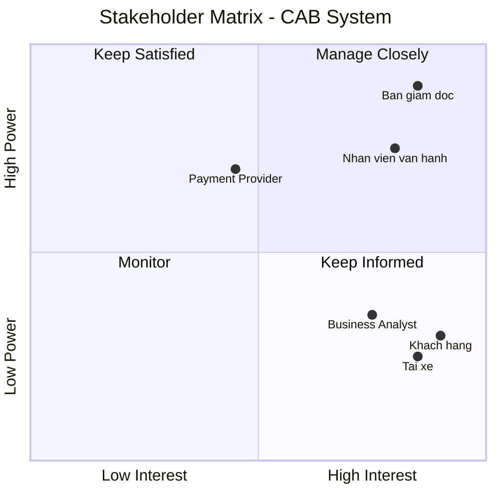

# 23696361_ThaiMaiKyHuong_cabsystem
# CAB System – Nền tảng đặt xe

## 1. KHÓ KHĂN CỦA HỆ THỐNG CAB SYSTEM

* Hệ thống chỉ có thể liên hệ đặt xe thông qua tổng đài hoặc 1 ứng dụng đơn giản.
* Phân công tài xế được thực hiện thủ công.
* Khách hàng khó theo dõi được trạng thái chuyến đi.
* Quản lý thanh toán chưa tập trung.
* Khó vận hành khi mở rộng hệ thống.
* Khó khăn về thông báo.

## * GIẢI PHÁP CHO HỆ THỐNG CAB SYSTEM

* Xây dựng ứng dụng CAB System đầy đủ chức năng đặt xe, theo dõi chuyến, thanh toán và đánh giá.
* Tự động tìm và phân công tài xế phù hợp dựa trên vị trí, trạng thái và loại xe. Nếu tài xế từ chối, tự động tìm tài xế khác.
* Cung cấp tính năng theo dõi trạng thái và vị trí tài xế theo thời gian thực.
* Xây dựng hệ thống quản lý thanh toán và tích hợp với các cổng thanh toán bên ngoài.
* Thiết kế hệ thống theo các module/service độc lập, có khả năng mở rộng từng thành phần.
* Xây dựng hệ thống thông báo đa kênh như Push Notification, SMS, Email và có thể mở rộng thêm trong tương lai.

---

## 2. XÁC ĐỊNH CÁC STAKEHOLDER

| STT | Stakeholder                           | Vai trò trong hệ thống                                                                                                |
| :-- | :------------------------------------ | :-------------------------------------------------------------------------------------------------------------------- |
| 1   | **Ban giám đốc**                      | Đưa ra định hướng, mục tiêu và yêu cầu của hệ thống; mong muốn có báo cáo về hoạt động, doanh thu và hiệu quả tài xế. |
| 2   | **Khách hàng**                        | Đăng ký, đặt xe, theo dõi chuyến đi, thanh toán, xem lịch sử và đánh giá tài xế.                                      |
| 3   | **Tài xế**                            | Quản lý hồ sơ và phương tiện, nhận/từ chối chuyến, cập nhật trạng thái và thực hiện chuyến.                           |
| 4   | **Nhân viên vận hành**                | Quản lý khách hàng, tài xế, phương tiện, chuyến đi; theo dõi chuyến đang diễn ra và xử lý các trường hợp lỗi.         |
| 5   | **Nhà cung cấp thanh toán bên ngoài** | Cung cấp dịch vụ thanh toán điện tử tích hợp cho hệ thống CAB.                                                        |
| 6   | **Business Analyst (BA)**             | Làm rõ yêu cầu, quy trình nghiệp vụ, quy tắc và các vấn đề chưa được khách hàng xác định.                             |

### Stakeholder Matrix

---

## 3. XÁC ĐỊNH BUSINESS GOAL

### 1. Tự động hóa quy trình đặt xe

Xây dựng hệ thống giúp khách hàng đặt xe trực tuyến và giảm sự phụ thuộc vào tổng đài hoặc quy trình thủ công.

### 2. Tự động hóa việc tìm và phân công tài xế

Xây dựng cơ chế tự động tìm tài xế phù hợp, ưu tiên tài xế gần khách hàng và tự động tìm tài xế khác khi tài xế từ chối hoặc không phản hồi.

### 3. Nâng cao trải nghiệm khách hàng

Cho phép khách hàng theo dõi trạng thái chuyến đi, vị trí tài xế, thời gian dự kiến đến, lịch sử chuyến và đánh giá tài xế.

### 4. Quản lý thanh toán tập trung

Xây dựng cơ chế tính cước và quản lý thanh toán, hỗ trợ tiền mặt và thanh toán điện tử thông qua nhà cung cấp bên ngoài.

### 5. Nâng cao hiệu quả vận hành

Cung cấp giao diện quản trị giúp nhân viên quản lý khách hàng, tài xế, phương tiện và chuyến đi, đồng thời xử lý các trường hợp phát sinh.

### 6. Đảm bảo khả năng mở rộng

Xây dựng nền tảng có khả năng phục vụ số lượng lớn khách hàng và tài xế, đồng thời cho phép mở rộng từng thành phần khi nhu cầu tăng.

### 7. Tăng tính ổn định và bảo mật

Đảm bảo hệ thống hoạt động ổn định khi tải cao, hạn chế việc một chức năng bị lỗi ảnh hưởng đến toàn bộ hệ thống và bảo vệ dữ liệu cá nhân, vị trí và giao dịch.

### 8. Tạo nền tảng phát triển lâu dài

Thiết kế hệ thống linh hoạt để trong tương lai có thể thêm loại dịch vụ, phương thức thanh toán, kênh thông báo và thay đổi thành phần kỹ thuật mà không phải xây dựng lại toàn bộ hệ thống.

## 4. XÁC ĐỊNH PHẠM VI HỆ THỐNG

Trong thời gian **7 tuần**, dự án tập trung xây dựng các chức năng cốt lõi của nền tảng CAB, bao gồm:

### 1. Hệ thống quản lý khách hàng

* Đăng ký, đăng nhập và xác thực tài khoản khách hàng.
* Quản lý và cập nhật thông tin cá nhân.
* Quản lý trạng thái tài khoản khách hàng.

### 2. Hệ thống quản lý tài xế và phương tiện

* Quản lý hồ sơ tài xế và thông tin phương tiện.
* Cập nhật trạng thái hoạt động của tài xế.
* Quản lý vị trí và trạng thái sẵn sàng nhận chuyến.

### 3. Hệ thống đặt xe và quản lý chuyến đi

* Khách hàng nhập điểm đón, điểm đến và lựa chọn loại xe.
* Tạo và quản lý yêu cầu đặt xe.
* Theo dõi trạng thái chuyến từ lúc đặt xe đến khi hoàn thành.
* Lưu thông tin và trạng thái của chuyến đi.

### 4. Hệ thống tìm và phân công tài xế

* Tự động tìm tài xế phù hợp dựa trên vị trí và trạng thái hoạt động.
* Ưu tiên tài xế gần khách hàng.
* Tự động tìm tài xế khác khi tài xế từ chối hoặc không phản hồi.
* Thông báo khi không tìm được tài xế.

### 5. Hệ thống tính cước và thanh toán

* Tính cước dựa trên loại dịch vụ và thông tin chuyến đi.
* Hỗ trợ thanh toán tiền mặt và thanh toán điện tử.
* Tích hợp với nhà cung cấp thanh toán bên ngoài.
* Quản lý trạng thái giao dịch và xử lý thanh toán thất bại.

### 6. Hệ thống thông báo

* Thông báo cho khách hàng và tài xế về các thay đổi quan trọng của chuyến đi.
* Thông báo khi đặt xe, tài xế nhận chuyến, tài xế đến điểm đón, hoàn thành chuyến và thanh toán.
* Thiết kế linh hoạt để có thể bổ sung thêm các kênh thông báo.

### 7. Hệ thống đánh giá và lịch sử chuyến đi

* Khách hàng có thể xem lịch sử các chuyến đã thực hiện.
* Hiển thị thông tin chuyến đi như tài xế, thời gian, trạng thái và số tiền thanh toán.
* Cho phép khách hàng đánh giá tài xế sau khi hoàn thành chuyến.
* Lưu trữ đánh giá để hỗ trợ theo dõi chất lượng dịch vụ.

### 8. Hệ thống quản trị và báo cáo

* Quản lý khách hàng, tài xế, phương tiện và chuyến đi.
* Theo dõi các chuyến đang diễn ra và xử lý các trường hợp phát sinh.
* Phân quyền cho nhân viên vận hành.
* Thống kê số lượng chuyến, doanh thu, tỷ lệ hoàn thành, tỷ lệ hủy và hiệu quả tài xế.

---

## 5. Yêu Cầu Nghiệp Vụ (Business Requirements)

### 1. Nhóm Yêu Cầu Cho Khách Hàng (Customer Requirements)

* **Quản lý tài khoản:** Khách hàng có thể đăng ký tài khoản mới, đăng nhập vào hệ thống và cập nhật thông tin cá nhân.
* **Đặt xe:** Khách hàng có thể nhập điểm đón, điểm đến, lựa chọn loại xe, gửi yêu cầu đặt xe và theo dõi trạng thái chuyến đi.
* **Theo dõi thời gian thực:** Khách hàng có thể biết được hệ thống đang tìm tài xế, xem thông tin tài xế đã nhận chuyến, thời gian dự kiến tài xế đến và trạng thái hiện tại của chuyến đi.
* **Thanh toán & Đánh giá:** Khách hàng có thể xem lịch sử chuyến đi, biết số tiền phải trả, chọn thanh toán bằng tiền mặt hoặc qua cổng thanh toán điện tử, và đánh giá tài xế sau khi hoàn thành chuyến.

### 2. Nhóm Yêu Cầu Cho Tài Xế (Driver Requirements)

* **Quản lý hồ sơ & Trạng thái:** Tài xế có thể đăng ký hoặc được nhân viên vận hành tạo tài khoản, cập nhật hồ sơ cá nhân, thông tin phương tiện và chuyển đổi trạng thái hoạt động.
* **Xử lý chuyến đi:** Tài xế nhận thông báo khi có yêu cầu phù hợp, có thể chấp nhận hoặc từ chối chuyến đi.
* **Cập nhật hành trình:** Trong quá trình thực hiện, tài xế cập nhật các mốc trạng thái: đã đến điểm đón, đã đón khách, đang di chuyển và hoàn thành chuyến đi.
* **Định vị GPS:** Hệ thống lưu trữ thông tin vị trí của tài xế để hỗ trợ việc tìm kiếm tài xế gần khách hàng và cải thiện khả năng dự kiến thời gian đến (ETA).

### 3. Nhóm Yêu Cầu Về Ghép Đôi Tài Xế (Matching Requirements)

* **Tìm kiếm & Phân phối thông minh:** Khi khách hàng tạo chuyến đi, hệ thống tự động xác định các tài xế phù hợp dựa trên vị trí, trạng thái sẵn sàng và các tiêu chí ưu tiên.
* **Cơ chế chuyển tiếp tự động:** Nếu tài xế được đề xuất không phản hồi hoặc từ chối, hệ thống tiếp tục tự động tìm tài xế khác mà không yêu cầu khách hàng phải tạo lại yêu cầu.
* **Xử lý khi không có tài xế:** Trường hợp hệ thống không tìm được tài xế phù hợp, khách hàng phải được thông báo rõ ràng.

### 4. Nhóm Yêu Cầu Về Tính Cước & Thanh Toán (Pricing & Payment Requirements)

* **Tính cước tự động:** Sau khi chuyến đi hoàn thành, hệ thống xác định số tiền khách hàng phải trả dựa trên loại dịch vụ và thông tin chuyến đi.
* **Thanh toán bảo mật:** Hỗ trợ thanh toán bằng tiền mặt hoặc tích hợp nhà cung cấp thanh toán bên ngoài, không lưu trữ thông tin nhạy cảm của thẻ/tài khoản trực tiếp trong hệ thống CAB.
* **Xử lý giao dịch lỗi:** Nếu giao dịch thanh toán điện tử thất bại, hệ thống phải thông báo cho khách hàng và cho phép xử lý lại theo chính sách của doanh nghiệp.

### 5. Nhóm Yêu Cầu Về Thông Báo (Notification Requirements)

* **Sự kiện thông báo cho khách hàng:** Gửi thông báo khi yêu cầu đặt xe được tiếp nhận, khi có tài xế nhận chuyến, khi tài xế đến điểm đón, khi chuyến hoàn thành và khi thanh toán có kết quả.
* **Sự kiện thông báo cho tài xế:** Gửi thông báo về các chuyến mới hoặc những thay đổi liên quan đến chuyến đang thực hiện.
* **Mở rộng kênh:** Hệ thống thông báo phải có khả năng mở rộng thêm các kênh thông báo trong tương lai mà không phải thay đổi toàn bộ hệ thống.

### 6. Nhóm Yêu Cầu Cho Nhân Viên Vận Hành & Quản Trị (Operations & Admin Requirements)

* **Quản lý vận hành:** Cung cấp giao diện quản trị để quản lý khách hàng, tài xế, phương tiện và chuyến đi; cho phép theo dõi các chuyến đang diễn ra, kiểm tra trạng thái tài xế, xử lý các trường hợp chuyến bị lỗi và tra cứu lịch sử giao dịch.
* **Phân quyền bảo mật:** Các chức năng quản trị phải được phân quyền để nhân viên thông thường không thể thực hiện các thao tác nhạy cảm.
* **Báo cáo thống kê:** Cung cấp báo cáo về số lượng chuyến, doanh thu, tỷ lệ chuyến hoàn thành, tỷ lệ hủy và hiệu quả hoạt động của tài xế cho Ban lãnh đạo.

---

# 6. PHÂN RÃ YÊU CẦU CHỨC NĂNG (FUNCTIONAL REQUIREMENTS)

## 1. Quản lý tài khoản khách hàng

### FR-CUS-01: Đăng ký tài khoản

* Khách hàng nhập các thông tin cần thiết để đăng ký tài khoản.
* Hệ thống kiểm tra tính hợp lệ của thông tin.
* Hệ thống kiểm tra tài khoản đã tồn tại hay chưa.
* Nếu thông tin hợp lệ, hệ thống tạo tài khoản khách hàng.

### FR-CUS-02: Đăng nhập

* Khách hàng nhập thông tin đăng nhập.
* Hệ thống xác thực thông tin tài khoản.
* Nếu thông tin chính xác, hệ thống cho phép khách hàng truy cập các chức năng dành cho khách hàng.
* Nếu thông tin không chính xác, hệ thống thông báo lỗi.

### FR-CUS-03: Cập nhật thông tin cá nhân

* Khách hàng có thể xem thông tin cá nhân.
* Khách hàng có thể cập nhật các thông tin được phép thay đổi.
* Hệ thống kiểm tra tính hợp lệ trước khi lưu thông tin.

---

## 2. Đặt xe và theo dõi chuyến đi

### FR-BOOK-01: Nhập thông tin chuyến xe

* Khách hàng nhập điểm đón.
* Khách hàng nhập điểm đến.
* Khách hàng lựa chọn loại xe/dịch vụ.
* Hệ thống kiểm tra thông tin chuyến trước khi tiếp nhận.

### FR-BOOK-02: Tạo yêu cầu đặt xe

* Khách hàng gửi yêu cầu đặt xe.
* Hệ thống tạo chuyến đi với trạng thái **Đang tìm tài xế**.
* Hệ thống chuyển yêu cầu đến chức năng tìm và phân công tài xế.

### FR-BOOK-03: Theo dõi trạng thái chuyến

* Khách hàng có thể xem trạng thái hiện tại của chuyến.
* Hệ thống cập nhật trạng thái khi chuyến thay đổi.
* Các trạng thái chính gồm: Đang tìm tài xế, Đã nhận tài xế, Tài xế đã đến, Đã đón khách, Đang di chuyển và Hoàn thành.

### FR-BOOK-04: Xem thông tin tài xế

* Sau khi tài xế nhận chuyến, khách hàng có thể xem thông tin tài xế.
* Khách hàng có thể xem thông tin phương tiện.
* Khách hàng có thể xem thời gian dự kiến tài xế đến.

---

## 3. Quản lý tài xế và phương tiện

### FR-DRV-01: Quản lý hồ sơ tài xế

* Tài xế có thể đăng ký tài khoản hoặc được nhân viên vận hành tạo tài khoản.
* Tài xế có thể xem và cập nhật thông tin hồ sơ.
* Hệ thống lưu thông tin tài xế.

### FR-DRV-02: Quản lý thông tin phương tiện

* Tài xế có thể cập nhật thông tin phương tiện.
* Hệ thống lưu thông tin phương tiện gắn với tài xế.
* Nhân viên vận hành có thể tra cứu thông tin phương tiện.

### FR-DRV-03: Cập nhật trạng thái hoạt động

* Tài xế có thể chuyển sang trạng thái sẵn sàng nhận chuyến.
* Tài xế có thể chuyển sang trạng thái không sẵn sàng.
* Hệ thống sử dụng trạng thái này trong quá trình tìm tài xế.

### FR-DRV-04: Cập nhật vị trí

* Hệ thống tiếp nhận thông tin vị trí của tài xế.
* Hệ thống lưu thông tin vị trí phục vụ việc tìm tài xế phù hợp.
* Thông tin vị trí được sử dụng để hỗ trợ tính thời gian dự kiến tài xế đến.

---

## 4. Xử lý và ghép đôi tài xế

### FR-MAT-01: Tìm tài xế phù hợp

* Hệ thống tiếp nhận yêu cầu tìm tài xế từ chuyến mới.
* Hệ thống xác định các tài xế đang sẵn sàng nhận chuyến.
* Hệ thống xem xét vị trí và loại xe phù hợp.
* Hệ thống ưu tiên tài xế phù hợp và gần khách hàng.

### FR-MAT-02: Gửi yêu cầu nhận chuyến

* Hệ thống gửi thông báo yêu cầu nhận chuyến đến tài xế phù hợp.
* Tài xế có thể chấp nhận hoặc từ chối chuyến.
* Hệ thống ghi nhận kết quả phản hồi của tài xế.

### FR-MAT-03: Tự động tìm tài xế khác

* Nếu tài xế từ chối chuyến, hệ thống tiếp tục tìm tài xế khác.
* Nếu tài xế không phản hồi trong thời gian quy định, hệ thống tiếp tục tìm tài xế khác.
* Khách hàng không cần tạo lại yêu cầu đặt xe.

### FR-MAT-04: Không tìm được tài xế

* Hệ thống xác định khi không còn tài xế phù hợp.
* Hệ thống cập nhật trạng thái yêu cầu.
* Hệ thống thông báo rõ ràng cho khách hàng.

---

## 5. Thực hiện và cập nhật chuyến đi

### FR-TRIP-01: Tài xế bắt đầu thực hiện chuyến

* Sau khi nhận chuyến, tài xế có thể bắt đầu thực hiện chuyến.
* Hệ thống cập nhật trạng thái chuyến tương ứng.

### FR-TRIP-02: Cập nhật trạng thái hành trình

* Tài xế cập nhật trạng thái **Đã đến điểm đón**.
* Tài xế cập nhật trạng thái **Đã đón khách**.
* Tài xế cập nhật trạng thái **Đang di chuyển**.
* Tài xế cập nhật trạng thái **Hoàn thành chuyến**.

### FR-TRIP-03: Theo dõi vị trí tài xế

* Hệ thống cập nhật vị trí tài xế trong quá trình thực hiện chuyến.
* Khách hàng có thể theo dõi vị trí tài xế theo thông tin hệ thống cung cấp.

---

## 6. Tính cước và thanh toán

### FR-PAY-01: Tính cước chuyến đi

* Khi chuyến hoàn thành, hệ thống xác định số tiền khách hàng phải trả.
* Số tiền được tính dựa trên loại dịch vụ và thông tin chuyến đi.
* Hệ thống lưu thông tin cước của chuyến.

### FR-PAY-02: Thanh toán tiền mặt

* Khách hàng có thể lựa chọn thanh toán bằng tiền mặt.
* Hệ thống ghi nhận trạng thái thanh toán sau khi chuyến hoàn thành.

### FR-PAY-03: Thanh toán điện tử

* Khách hàng có thể lựa chọn phương thức thanh toán điện tử.
* Hệ thống chuyển yêu cầu thanh toán đến nhà cung cấp bên ngoài.
* Hệ thống tiếp nhận kết quả giao dịch.
* Hệ thống không lưu trực tiếp thông tin nhạy cảm của thẻ hoặc tài khoản thanh toán.

### FR-PAY-04: Xử lý thanh toán thất bại

* Hệ thống ghi nhận giao dịch thất bại.
* Hệ thống thông báo kết quả cho khách hàng.
* Khách hàng có thể thực hiện lại thanh toán theo chính sách của doanh nghiệp.

---

## 7. Thông báo

### FR-NOT-01: Thông báo cho khách hàng

Hệ thống gửi thông báo khi:

* Yêu cầu đặt xe được tiếp nhận.
* Tài xế nhận chuyến.
* Tài xế đến điểm đón.
* Chuyến đi hoàn thành.
* Thanh toán có kết quả.

### FR-NOT-02: Thông báo cho tài xế

Hệ thống gửi thông báo khi:

* Có chuyến mới phù hợp.
* Chuyến đang thực hiện có thay đổi.
* Có các thông tin quan trọng liên quan đến chuyến.

### FR-NOT-03: Quản lý kênh thông báo

* Hệ thống hỗ trợ các kênh thông báo được doanh nghiệp lựa chọn.
* Kiến trúc thông báo cho phép bổ sung thêm kênh mới trong tương lai.

---

## 8. Đánh giá và lịch sử chuyến đi

### FR-HIS-01: Xem lịch sử chuyến

* Khách hàng có thể xem danh sách các chuyến đã thực hiện.
* Hệ thống hiển thị thông tin cơ bản của từng chuyến.
* Khách hàng có thể xem chi tiết chuyến khi cần.

### FR-HIS-02: Xem thông tin chi tiết chuyến

* Hiển thị thông tin điểm đón, điểm đến.
* Hiển thị thông tin tài xế và phương tiện.
* Hiển thị trạng thái chuyến.
* Hiển thị số tiền phải trả và trạng thái thanh toán.

### FR-HIS-03: Đánh giá tài xế

* Sau khi chuyến hoàn thành, khách hàng có thể đánh giá tài xế.
* Hệ thống ghi nhận và lưu kết quả đánh giá.
* Khách hàng không thể đánh giá chuyến chưa hoàn thành.

---

## 9. Quản trị và vận hành

### FR-ADM-01: Quản lý khách hàng

* Nhân viên vận hành có thể xem và tra cứu thông tin khách hàng.
* Nhân viên có thể xem lịch sử chuyến của khách hàng.
* Hệ thống kiểm soát quyền thực hiện các thao tác quản trị.

### FR-ADM-02: Quản lý tài xế

* Nhân viên vận hành có thể xem thông tin tài xế.
* Theo dõi trạng thái hoạt động của tài xế.
* Tra cứu thông tin phương tiện của tài xế.

### FR-ADM-03: Quản lý chuyến đi

* Nhân viên có thể xem các chuyến đang diễn ra.
* Theo dõi trạng thái của từng chuyến.
* Tra cứu lịch sử chuyến.
* Hỗ trợ xử lý các trường hợp chuyến bị lỗi hoặc phát sinh.

### FR-ADM-04: Quản lý giao dịch

* Nhân viên có thể tra cứu lịch sử giao dịch.
* Xem trạng thái thanh toán của chuyến.
* Hỗ trợ kiểm tra các giao dịch thanh toán thất bại.

### FR-ADM-05: Phân quyền quản trị

* Hệ thống phân quyền chức năng theo vai trò nhân viên.
* Nhân viên thông thường không được thực hiện các thao tác nhạy cảm nếu không có quyền.
* Hệ thống kiểm soát quyền trước khi thực hiện thao tác quản trị.

### FR-ADM-06: Báo cáo và thống kê

* Thống kê số lượng chuyến.
* Thống kê doanh thu.
* Thống kê tỷ lệ chuyến hoàn thành.
* Thống kê tỷ lệ chuyến hủy.
* Thống kê hiệu quả hoạt động của tài xế.
---
## 7. USE CASE DIAGRAM

9. ĐẶC TẢ USECASE 
10. PHÂN TÍCH QUY TRÌNH NGHIỆP VỤ
11. PHÂN TỊCH QUY TẮC NGHIỆP VỤ

   
