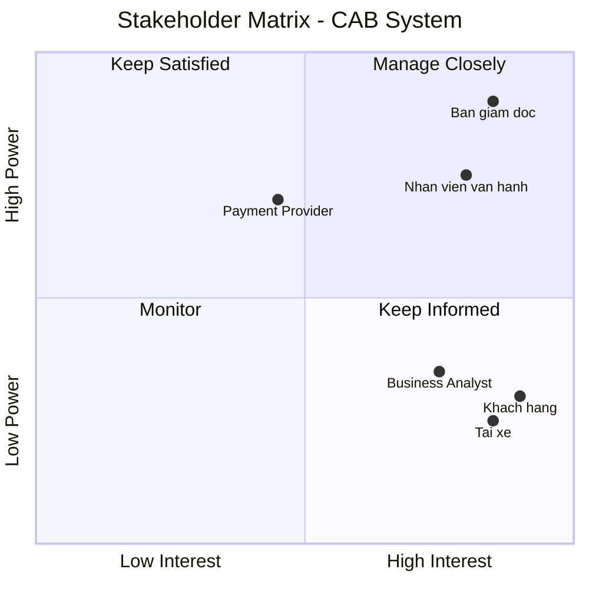

# 23696361_ThaiMaiKyHuong_cabsystem
1. KHÓ KHĂN CỦA HỆ THỐNG CAB SYSTEM
- Hệ thống chỉ có thể liên hệ đặt xe thông qua tổng đài hoặc 1 ứng dụng đơn giản
- Phân công tài xế được thực hiện thủ công
- Khách hàng khó theo dõi được trạng thái chuyến đi
- Quản lý thanh toán chưa tập trung
- Khó vận hành khi mở rộng hệ thống
- Khó khăn về thông báo 
2. GIẢI PHÁP CHO HỆ THỐNG CAB SYSTEM
- Xây dựng ứng dụng CAB System đầy đủ chức năng đặt xe, theo dõi chuyến, thanh toán và đánh giá.
- Tự động tìm và phân công tài xế phù hợp dựa trên vị trí, trạng thái và loại xe. Nếu tài xế từ chối, tự động tìm tài xế khác.
- Cung cấp tính năng theo dõi trạng thái và vị trí tài xế theo thời gian thực.
- Xây dựng hệ thống quản lý thanh toán và tích hợp với các cổng thanh toán bên ngoài.
- Thiết kế hệ thống theo các module/service độc lập, có khả năng mở rộng từng thành phần.
- Xây dựng hệ thống thông báo đa kênh như Push Notification, SMS, Email và có thể mở rộng thêm trong tương lai.
3. XÁC ĐỊNH CÁC STAKEHOLDER

| STT | Stakeholder | Vai trò trong hệ thống |
| :--- | :--- | :--- |
| 1 | **Ban giám đốc** | Đưa ra định hướng, mục tiêu và yêu cầu của hệ thống; mong muốn có báo cáo về hoạt động, doanh thu và hiệu quả tài xế. |
| 2 | **Khách hàng** | Đăng ký, đặt xe, theo dõi chuyến đi, thanh toán, xem lịch sử và đánh giá tài xế. |
| 3 | **Tài xế** | Quản lý hồ sơ và phương tiện, nhận/từ chối chuyến, cập nhật trạng thái và thực hiện chuyến. |
| 4 | **Nhân viên vận hành** | Quản lý khách hàng, tài xế, phương tiện, chuyến đi; theo dõi chuyến đang diễn ra và xử lý các trường hợp lỗi. |
| 5 | **Nhà cung cấp thanh toán bên ngoài** | Cung cấp dịch vụ thanh toán điện tử tích hợp cho hệ thống CAB. |
| 6 | **Business Analyst (BA)** | Làm rõ yêu cầu, quy trình nghiệp vụ, quy tắc và các vấn đề chưa được khách hàng xác định. |
## Stakeholder Matrix

4. XÁC ĐỊNH BUSINESS GOAL
1. Tự động hóa quy trình đặt xe.
   Xây dựng hệ thống giúp khách hàng đặt xe trực tuyến và giảm sự phụ thuộc vào tổng đài hoặc quy trình thủ công.
2. Tự động hóa việc tìm và phân công tài xế
   Xây dựng cơ chế tự động tìm tài xế phù hợp, ưu tiên tài xế gần khách hàng và tự động tìm tài xế khác khi tài xế từ chối hoặc không phản hồi.
3. Nâng cao trải nghiệm khách hàng
   Cho phép khách hàng theo dõi trạng thái chuyến đi, vị trí tài xế, thời gian dự kiến đến, lịch sử chuyến và đánh giá tài xế.
4. Quản lý thanh toán tập trung
   Xây dựng cơ chế tính cước và quản lý thanh toán, hỗ trợ tiền mặt và thanh toán điện tử thông qua nhà cung cấp bên ngoài.
5. Nâng cao hiệu quả vận hành
   Cung cấp giao diện quản trị giúp nhân viên quản lý khách hàng, tài xế, phương tiện và chuyến đi, đồng thời xử lý các trường hợp phát sinh.
6. Đảm bảo khả năng mở rộng
   Xây dựng nền tảng có khả năng phục vụ số lượng lớn khách hàng và tài xế, đồng thời cho phép mở rộng từng thành phần khi nhu cầu tăng.
7. Tăng tính ổn định và bảo mật
   Đảm bảo hệ thống hoạt động ổn định khi tải cao, hạn chế việc một chức năng bị lỗi ảnh hưởng đến toàn bộ hệ thống và bảo vệ dữ liệu cá nhân, vị trí và giao dịch.
8. Tạo nền tảng phát triển lâu dài
   Thiết kế hệ thống linh hoạt để trong tương lai có thể thêm loại dịch vụ, phương thức thanh toán, kênh thông báo và thay đổi thành phần kỹ thuật mà không phải xây dựng lại toàn bộ hệ thống.
   
5. XÁC ĐỊNH PHẠM VI HỆ THỐNG CẦN LÀM 

| STT | Tên Hệ Thống | Chức năng chính |
| :--- | :--- | :--- |
| **1** | **Hệ thống Quản lý Khách hàng & Người dùng (Customer & User Management)** | • Đăng ký, đăng nhập và xác thực tài khoản cho Khách hàng, Tài xế và Nhân viên vận hành. • Quản lý hồ sơ cá nhân, thông tin liên lạc và lịch sử chuyến đi của khách hàng. • Phân quyền truy cập theo vai trò (Role-Based Access Control). |
| **2** | **Hệ thống Quản lý Tài xế & Phương tiện (Driver & Fleet Management)** | • Quản lý hồ sơ tài xế và thông tin phương tiện. • Cập nhật và lưu trữ trạng thái hoạt động (Online/Offline) cùng tọa độ GPS thời gian thực. |
| **3** | **Hệ thống Ghép đôi chuyến đi (Matching & Dispatching Engine)** | • Thuật toán tìm kiếm và phân công tài xế gần nhất dựa trên vị trí và trạng thái. • Cơ chế tự động chuyển tài xế kế tiếp nếu tài xế hiện tại từ chối hoặc quá thời gian phản hồi. |
| **4** | **Hệ thống Quản lý Chuyến đi (Trip Management System)** | • Quản lý trọn vẹn vòng đời chuyến đi: Tạo yêu cầu $\rightarrow$ Tìm tài xế $\rightarrow$ Đã nhận $\rightarrow$ Đến điểm đón $\rightarrow$ Đang di chuyển $\rightarrow$ Hoàn thành/Hủy. |
| **5** | **Hệ thống Tính cước & Thanh toán (Pricing & Payment System)** | • Tính toán tiền cước dựa trên thông tin chuyến đi. • Xử lý thanh toán tiền mặt và tích hợp cổng thanh toán điện tử bên ngoài (bảo mật thông tin thẻ). |
| **6** | **Hệ thống Thông báo (Notification Service)** | • Gửi thông báo đa kênh (Push Notification, SMS, Email) theo từng mốc sự kiện của chuyến đi cho cả Khách hàng và Tài xế. |
| **7** | **Hệ thống Quản trị & Báo cáo (Admin Dashboard & Reporting)** | • Giao diện cho nhân viên vận hành theo dõi trực tiếp các chuyến xe, xử lý sự cố. • Cung cấp báo cáo thống kê về doanh thu, số lượng chuyến và hiệu suất tài xế. |
| **8** | **Hệ thống Lưu vết & Bảo mật (Audit Logging & Security)** | • Ghi nhận log các thao tác quan trọng, đặc biệt là các hành động quản trị. • Đảm bảo bảo mật dữ liệu cá nhân, vị trí và giao dịch. |

---
6. Yêu Cầu Nghiệp Vụ (Business Requirements) - Dự án CAB System

## 1. Nhóm Yêu Cầu Cho Khách Hàng (Customer Requirements)
* **CR-01 (Quản lý tài khoản):** Khách hàng có thể đăng ký tài khoản mới, đăng nhập vào hệ thống và cập nhật thông tin cá nhân.
* **CR-02 (Đặt xe):** Khách hàng có thể nhập điểm đón, điểm đến, lựa chọn loại xe, xem thông tin ước tính/gửi yêu cầu đặt xe và theo dõi trạng thái chuyến đi.
* **CR-03 (Theo dõi thời gian thực):** Khách hàng có thể biết được hệ thống đang tìm tài xế, xem thông tin tài xế đã nhận chuyến, thời gian dự kiến tài xế đến và trạng thái hiện tại của chuyến đi.
* **CR-04 (Thanh toán & Đánh giá):** Khách hàng có thể xem lịch sử chuyến đi, biết số tiền phải trả, chọn thanh toán bằng tiền mặt hoặc qua cổng thanh toán điện tử, và đánh giá tài xế sau khi hoàn thành chuyến.

## 2. Nhóm Yêu Cầu Cho Tài Xế (Driver Requirements)
* **DR-01 (Quản lý hồ sơ & Trạng thái):** Tài xế có thể đăng ký hoặc được nhân viên vận hành tạo tài khoản, cập nhật hồ sơ cá nhân, thông tin phương tiện và chuyển đổi trạng thái hoạt động (sẵn sàng nhận chuyến).
* **DR-02 (Xử lý chuyến đi):** Tài xế nhận thông báo khi có yêu cầu phù hợp, có thể chấp nhận hoặc từ chối chuyến đi.
* **DR-03 (Cập nhật hành trình):** Trong quá trình thực hiện, tài xế cập nhật các mốc trạng thái: đã đến điểm đón, đã đón khách, đang di chuyển và hoàn thành chuyến đi.
* **DR-04 (Định vị GPS):** Hệ thống lưu trữ thông tin vị trí của tài xế để hỗ trợ việc tìm kiếm tài xế gần khách hàng nhất và cải thiện khả năng dự kiến thời gian đến (ETA).

## 3. Nhóm Yêu Cầu Về Ghép Đôi Tài Xế (Matching Requirements)
* **MR-01 (Tìm kiếm & Phân phối thông minh):** Khi khách hàng tạo chuyến đi, hệ thống tự động xác định các tài xế phù hợp dựa trên vị trí, trạng thái sẵn sàng và các tiêu chí ưu tiên gần khách hàng nhất.
* **MR-02 (Cơ chế chuyển tiếp tự động):** Nếu tài xế được đề xuất không phản hồi hoặc từ chối, hệ thống tiếp tục tự động tìm tài xế khác mà không yêu cầu khách hàng phải tạo lại yêu cầu.
* **MR-03 (Xử lý khi không có tài xế):** Trường hợp hệ thống không tìm được tài xế phù hợp, khách hàng phải được thông báo rõ ràng.

## 4. Nhóm Yêu Cầu Về Thanh Vận & Thanh Toán (Pricing & Payment Requirements)
* **PR-01 (Tính cước tự động):** Sau khi chuyến đi hoàn thành, hệ thống xác định số tiền khách hàng phải trả dựa trên loại dịch vụ và thông tin chuyến đi.
* **PR-02 (Thanh toán bảo mật):** Hỗ trợ thanh toán bằng tiền mặt hoặc tích hợp nhà cung cấp thanh toán bên ngoài, **tuyệt đối không lưu trữ thông tin nhạy cảm của thẻ/tài khoản** trực tiếp trong hệ thống CAB.
* **PR-03 (Xử lý giao dịch lỗi):** Nếu giao dịch thanh toán điện tử thất bại, hệ thống phải thông báo cho khách hàng và cho phép xử lý lại theo chính sách của doanh nghiệp.

## 5. Nhóm Yêu Cầu Về Thông Báo (Notification Requirements)
* **NR-01 (Sự kiện thông báo cho khách hàng):** Gửi thông báo khi yêu cầu đặt xe được tiếp nhận, khi có tài xế nhận chuyến, khi tài xế đến điểm đón, khi chuyến hoàn thành và khi thanh toán có kết quả.
* **NR-02 (Sự kiện thông báo cho tài xế):** Gửi thông báo về các chuyến mới hoặc những thay đổi liên quan đến chuyến đang thực hiện.
* **NR-03 (Mở rộng kênh):** Hệ thống thông báo phải có khả năng mở rộng thêm các kênh thông báo trong tương lai mà không phải thay đổi toàn bộ hệ thống.

## 6. Nhóm Yêu Cầu Cho Nhân Viên Vận Hành & Quản Trị (Operations & Admin Requirements)
* **OR-01 (Quản lý vận hành):** Cung cấp giao diện quản trị để quản lý khách hàng, tài xế, phương tiện và chuyến đi; cho phép theo dõi các chuyến đang diễn ra, kiểm tra trạng thái tài xế, xử lý các trường hợp chuyến bị lỗi và tra cứu lịch sử giao dịch.
* **OR-02 (Phân quyền bảo mật):** Các chức năng quản trị phải được phân quyền để nhân viên thông thường không thể thực hiện các thao tác nhạy cảm.
* **OR-03 (Báo cáo thống kê):** Cung cấp báo cáo về số lượng chuyến, doanh thu, tỷ lệ chuyến hoàn thành, tỷ lệ hủy và hiệu quả hoạt động của tài xế cho Ban lãnh đạo.

   
